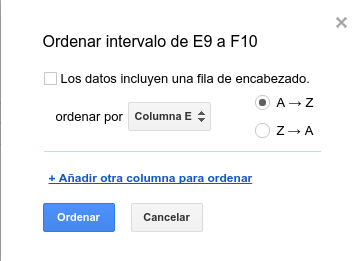
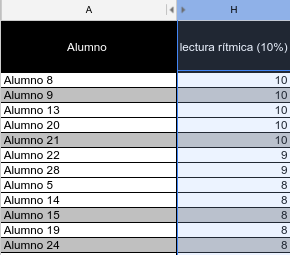
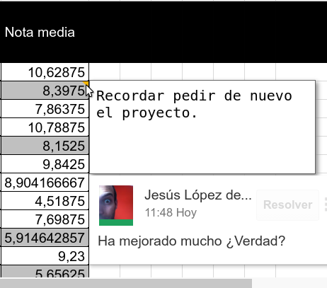
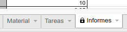

# Ordena, filtra y colabora en Hojas de Cálculo

## Ordenar y filtrar

Podemos ordenar toda una hoja en base a los valores de una columna, o bien podemos acotar la ordenación a un intervalo de celdas.
-   Ordenar hoja: clica en una celda de la columna que quieras ordenar. Selecciona *Ordenar hoja por columna X...* en el menú datos.
-   Ordenar intervalo: selecciona el intervalo de celdas que quieras ordenar, clica sobre la selección con el botón derecho y después en *Ordenar intervalo..*.

En el siguiente ejemplo puedes ver cómo los alumnos han quedado ordenados por la nota obtenida en el examen.

Ahora quiero ver sólo los alumnos aprobados, ¿cómo lo hago? Fácil, filtrando los datos. Para ello sólo tengo que clicar sobre una celda de la columna cuyos datos quiera filtrar y clicar en botón correspondiente . En la primera fila de nuestro conjunto de datos aparecerá una flecha. Podremos entonces filtrar por valor o por condición. Vuelve a clicar sobre el icono de filtro para ver de nuevo todos los datos.

## Colaborar

Una vez vistas las opciones para [compartir desde Google Drive](compartir-y-colaborar.md) y las [herramientas de colaboración de Documentos](colaborando-con-documentos-de-google.md), echemos un ojo a las opciones de Hojas de Cálculo de Google Drive.

Al igual que en Documentos, Hojas de Cálculo permite la inserción de **Comentarios** con las opciones ya conocidas. Eso sí, en este caso los comentarios se insertan en cada celda. Una vez hecho el comentario, queda oculto y la celda marcada en su esquina superior derecha con un pequeño triángulo naranja. Al pasar por encima de ella con el ratón volverán a aparecer los comentarios asociados. Para insertar un comentario clica con el botón derecho sobre la celda deseada y selecciona *Insertar comentario*.

Justo debajo de esta opción encontrarás la de *Insertar nota*. Se trata de la versión simple de los comentarios. Es decir, no cuenta con las opciones de responder, resolver ni realiza el seguimiento de quién ha escrito qué. Por lo demás funciona igual. La casilla que contenta *notas* quedará marcada en negro esta vez.

¿Has compartido tu hoja de cálculo para que cada colaborador rellene una parte? Asegúrate de que no trabajen en las celdas u hojas equivocadas. Protégelas! Para acceder a la opción **Hojas e intervalos progetidos** selecciona el intervalo de celdas y clica sobre ellas con el botón derecho. Entre las opciones del menú contextual encontrarás *Proteger intervalo*. A continuación aparecerá una barra a la derecha como la que ves en la imagen. Pues *Establecer permisos* para esa hoja o intevalo concreto. Una herramienta muy potente, ¿verdad?

Para proteger una hoja solo tienes que clicar con el botón derecho sobre la pestaña de la hoja a proteger y seguir los pasos anteriores.

No olvides [utilizar el chat](colaborando-con-documentos-de-google.md).

**¡Has llegado al final de este módulo!** No olvides tomarte un merecido descanso.

https://www.youtube.com/watch?v=QZNtvJyMHDU