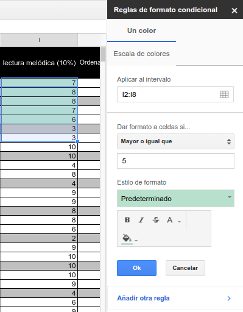
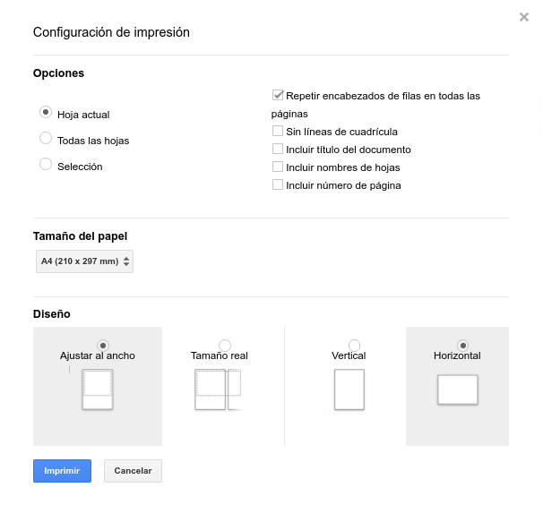

# Dando formato a Hojas de Cáluclo en Google Drive

La forma en la que visualizamos los datos es fundamental para que éstos sean significativos, para que nos digan algo de forma sencilla y clara. A continuación verás cómo cuidar el formato de las hojas de cálculo que edites.

## Formato de la celda

Seleccionar qué **tipo de dato** está recogiendo cada rango de celdas nos facilitará mucho el posterior manejo de los datos. Para ello, selecciona el rango de celdas (conjunto de celdas) que vayan a contener el mismo tipo de dato -fecha, moneda...- y aplícalo. Puedes acceder a las distintas opciones a través de la barra de herramientas o desde el menú *Formato*.

Otra herramienta extremadamente útil es la de **Formato condicional**. Imagina que tienes un hoja de notas de tus alumnos y quieres que se resalten en color verde los aprobados. Seleccionando un rango de celdas y clicando sobre ellas con el botón derecho, puedes establecer ese formato para el fondo de la celda si la nota es igual o superior a 5. Esto es solo un ejemplo de las múltiples posibilidades tienes a tu disposición.

## Fuentes y fondo

Al igual que ocurre en el procesador de textos, a través de la barra de herramientas tienes acceso a las principales opciones de formato para texto y fondo de la celda.

## Bordes

Para resaltar los bordes de las celdas, el botón de la barra de herramientas  nos ofrece las siguientes opciones:

-   Elegir qué lados queremos resaltar (interiores verticales, exteriores, superiores...)
-   Elegir el color de la línea.
-   Elegir el tipo de trazo.

## Imprimir

Como suele ocurrir, para imprimir podemos clicar en el icono correspondiente o pulsar Ctrl+p. En el caso de Hojas de Cálculo, nos aparecerá un cuadro específico de configuración de la impresión. Conviene dedicar tiempo a probar las distintas opciones. El problema principal al imprimir hojas de cálculo es que éstas se ajusten al tamaño del papel. Para ello, en el apartado *Diseño*, selecciona las opciones más convenientes.

Si quieres que en la impresión aparezcan solo aquellos bordes que hayas resaltado, no olvides marcar la casilla 'Sin lineas de cuadrícula'.

Una vez configurada la impresión, llegarás al cuadro que ya vimos en el [segundo módulo](introduccion-a-documentos-de-google.md)

