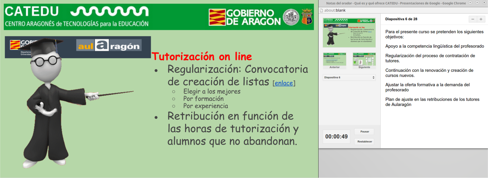

## Iniciar presentación

El botón *Iniciar presentación* hará que esta se visualice a pantalla completa ya sin opciones de edición. Podemos salir del modo presentación en cualquier momento pulsando *Escape (Esc)*. Para avanzar pulsa la tecla espacio del teclado, el botón izquierdo del ratón y dale al botón *play* y olvídate (en las opciones de la esquina inferior-izquierda.

## Iniciar presentación con las notas del orador

Clica en *iniciar presentación con las notas del orador* y éstas se mostrarán en una ventana a parte. Dicha ventana se mantendrá sincronizada con la presentación, mostrando en cada momento las notas de la diapositiva que esté activa.

¿Necesitas ver las notas más grandes? Clica en +. **¡Atención!** No olvides desactivar en tu ordenador la opción *duplicar pantalla*. Si no lo haces se te verá el plumero. (Más información para [Linux](https://linuxaltrabajo.wordpress.com/2013/09/21/configurar-dos-monitores-con-escritorio-extendido), [Mac](https://bareando.wordpress.com/2008/03/03/configurar-pantallas-externas-en-mac) y [Windows](http://windows.microsoft.com/es-es/windows7/connect-to-a-projector))

