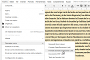

{#top}

Google drive/Colaborando con Documentos de Google {#firstHeading .firstHeading lang="es"}
=========================================================================

De WikiEducator

&lt; [Google
drive](/Google_drive "Google drive")

Saltar a: [navegación](#mw-navigation), [buscar](#p-search)

[Editando un
Documento](/Google_drive/Introducci%C3%B3n_a_Documentos_de_Google "Google drive/Introducción a Documentos de Google")
 |  [El menú
insertar](/Google_drive/El_men%C3%BA_insertar_en_Documentos_de_Google "Google drive/El menú insertar en Documentos de Google")
 |  [El menú
herramientas](/Google_drive/El_men%C3%BA_herramientas_en_Documentos_de_Google "Google drive/El menú herramientas en Documentos de Google")
 |  [Complementos y combinaciones de
teclas](/Google_drive/Complementos_y_combinaciones_de_teclas_en_Documentos_de_Google "Google drive/Complementos y combinaciones de teclas en Documentos de Google")
 |  **Colaborando**

\

{width="209" height="178"}

Colaborando en
Documentos

En el [primer
módulo](/Google_drive/Compartir_y_colaborar_en_Google_Drive "Google drive/Compartir y colaborar en Google Drive")
del curso vimos cómo compartir archivos en Google Drive. También puedes
compartir el archivo estando ya dentro del documento, clicando en
[{width="73" height="16"
srcset="/images/thumb/1/13/Bot%C3%B3n_compartir.png/110px-Bot%C3%B3n_compartir.png 1.5x, /images/thumb/1/13/Bot%C3%B3n_compartir.png/146px-Bot%C3%B3n_compartir.png 2x"}](/Archivo:Bot%C3%B3n_compartir.png "Compartir dentro de un documento de Google"){.image}
situado en la esquina superior derecha. A continuación profundizaremos
en las herramientas de edición colaborativa dentro de Documentos.

Comentar, sugerir y editar
---------------------------------------------------------------------------------------------

[{.thumbimage
width="180" height="176"
srcset="/images/c/cb/Comentando_en_Documentos_de_Google.png 1.5x, /images/c/cb/Comentando_en_Documentos_de_Google.png 2x"}](/Archivo:Comentando_en_Documentos_de_Google.png){.image}

[{width="15"
height="11"}](/Archivo:Comentando_en_Documentos_de_Google.png "Aumentar"){.internal}

Comentando en Documentos de Google

Una vez compartido el documento podremos practicar con los comentarios y
sugerencias de revisión. ¿Hay un punto controvertido? Selecciona el
texto o la imagen y clica en el icono de comentario. Los colaboradores
podrán responder a la nota que has añadido a la derecha del texto, e
incluso resolverla si procede, eliminando todos los comentarios
realizados sobre el item en concreto.
¿Vas a realizar un cambio necesario y obvio, pero quieres contar con la
aprobación del autor? Puede sugerir una edición. Si los colaboradores
están de acuerdo sólo tendrán que aceptarla y tu texto sustituirá
automáticamente al anterior. Para hacer esto cambia de modo **edición**
a modo **sugerencias**, selecciona el texto o la imagen en cuestión y
comienza a escribir tu aportación.

[{width="654"
height="90"}](/Archivo:Sugiriendo_en_Documentos_de_Google.png "Sugiriendo en Documentos de Google"){.image}

Si varias personas están editando un documento al mismo tiempo, los
cambios podrán verse en las pantallas de todos los colaboradores en
tiempo real. El cursor coloreado identifica a cada colaborador. Podrás
chatear con ellos clicando sobre sus avatares para un comunicación más
fluida.

Ver historial de revisión
----------------------------------------------------------------------------------------------

¿Alguien ha añadido material inadecuado o ha borrado algo importante de
nuestro texto? No pasa nada. Accediendo al historial de revisión verás
quién ha editado el documento y qué cambios ha realizado en cada
momento. Podrás también reestablecer el documento a una versión
anterior, recuperando tu texto y la calma.

Visita el historial de revisión en *Archivo*-*Ver historial de
revisión*. Una vez ahí puedes ir clicando en las distintas versiones. Se
te mostrará la opción *Restaurar esta revisión*. Si clicas sobre el
nombre de cada colaborador, aparecerán coloreadas -con el color que
identifica a cada uno- las modificaciones que ha realizado en esa
revisión.

Descarga, publica y comparte
-------------------------------------------------------------------------------------------------

[{.thumbimage
width="180" height="120"
srcset="/images/thumb/f/f2/Descargando_Documentos_de_Google.png/270px-Descargando_Documentos_de_Google.png 1.5x, /images/thumb/f/f2/Descargando_Documentos_de_Google.png/360px-Descargando_Documentos_de_Google.png 2x"}](/Archivo:Descargando_Documentos_de_Google.png){.image}

[{width="15"
height="11"}](/Archivo:Descargando_Documentos_de_Google.png "Aumentar"){.internal}

Descargando Documentos de Google

Si el documento ya está listo, puedes descargarlo en multitud de
formatos e incluso publicarlo en la web mediante un enlace o embebido en
tu blog. También puedes enviarlo como archivo adjunto a un mail desde la
propia interfaz de Documentos. Todas estas opciones están disponibles
desde el menú Archivo.
Y por último, ¿ves que tu compañero está editando en ese momento y
quieres decirle algo? Aprovecha el chat integrado. Clica sobre el icono
[{width="13"
height="14"}](/Archivo:Icono_de_chat.png "Icono de chat"){.image} junto
a los avatares de los participantes.

**¡Has llegado al final de este módulo!** No olvides tomarte un merecido
descanso.

[Editando un
Documento](/Google_drive/Introducci%C3%B3n_a_Documentos_de_Google "Google drive/Introducción a Documentos de Google")
 |  [El menú
insertar](/Google_drive/El_men%C3%BA_insertar_en_Documentos_de_Google "Google drive/El menú insertar en Documentos de Google")
 |  [El menú
herramientas](/Google_drive/El_men%C3%BA_herramientas_en_Documentos_de_Google "Google drive/El menú herramientas en Documentos de Google")
 |  [Complementos y combinaciones de
teclas](/Google_drive/Complementos_y_combinaciones_de_teclas_en_Documentos_de_Google "Google drive/Complementos y combinaciones de teclas en Documentos de Google")
 |  **Colaborando**

\

Obtenido de
«<http://es.wikieducator.org/index.php?title=Google_drive/Colaborando_con_Documentos_de_Google&oldid=19159>»

