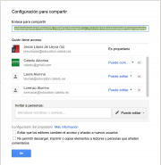
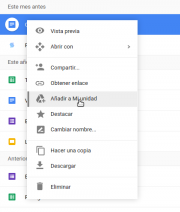

{#top}

Google drive/Compartir y colaborar en Google Drive {#firstHeading .firstHeading lang="es"}
==========================================================================

De WikiEducator

&lt; [Google
drive](/Google_drive "Google drive")

Saltar a: [navegación](#mw-navigation), [buscar](#p-search)

[Introducción](/Google_drive/Introducci%C3%B3n "Google drive/Introducción")
 |  [Primeros
pasos](/Google_drive/Primeros_pasos "Google drive/Primeros pasos")  | 
[Creación y gestión de
archivos](/Google_drive/Creaci%C3%B3n_y_gesti%C3%B3n_de_archivos_en_Google_Drive "Google drive/Creación y gestión de archivos en Google Drive")
 |  **Compartir y colaborar**  |  [Para ordenador y
móvil](/Google_drive/Google_Drive_para_ordenador_y_m%C3%B3vil "Google drive/Google Drive para ordenador y móvil")

\

{width="209" height="178"}

Compartir
Documentos

Veamos el verdadero potencial de Google Drive y sus productos: las
herramientas de colaboración. Antes de continuar, conviene tener claro
que dentro las aplicaciones de Google Drive suele haber varias formas de
realizar una tarea. Veremos solo algunas de ellas para no añadir
complejidad al tema.

Cómo compartir un documento
--------------------------------------------------------------------------------------------------

[{.thumbimage
width="180" height="185"
srcset="/images/thumb/3/3d/Configuraci%C3%B3n_avanzada_para_compartir.png/270px-Configuraci%C3%B3n_avanzada_para_compartir.png 1.5x, /images/thumb/3/3d/Configuraci%C3%B3n_avanzada_para_compartir.png/360px-Configuraci%C3%B3n_avanzada_para_compartir.png 2x"}](/Archivo:Configuraci%C3%B3n_avanzada_para_compartir.png){.image}

[{width="15"
height="11"}](/Archivo:Configuraci%C3%B3n_avanzada_para_compartir.png "Aumentar"){.internal}

Configuración avanzada para compartir

Si quieres compartir tu documento, selecciónalo y clica en el botón para
compartir [{width="23"
height="19"}](/Archivo:Compartir.png "Compartir en Google Drive"){.image}.
A continuación aparecerá una ventana en la que podrás añadir los correos
de los colaboradores que desees y seleccionar los permisos que otorgas
sobre el documento en cuestión:
-   Puede editar.
-   Puede comentar.
-   Puede ver.

Otra opción es compartir un enlace al documento [{width="19"
height="11"}](/Archivo:Hiperv%C3%ADnculo.png "Habilitar enlace para compartir en Google Drivev"){.image},
seleccionando también los permisos. Es posible dar permisos distintos
dependiendo del tipo de acceso -invitación por mail o mediante enlace-.

Si clicas en *Avanzada* puedes configurar más opciones como *Evitar que
los editores cambien el acceso y añadan a nuevos usuarios*.

Compartido conmigo
---------------------------------------------------------------------------

[{.thumbimage width="180"
height="212"
srcset="/images/thumb/5/56/A%C3%B1adir_a_mi_Drive.png/270px-A%C3%B1adir_a_mi_Drive.png 1.5x, /images/thumb/5/56/A%C3%B1adir_a_mi_Drive.png/360px-A%C3%B1adir_a_mi_Drive.png 2x"}](/Archivo:A%C3%B1adir_a_mi_Drive.png){.image}

[{width="15"
height="11"}](/Archivo:A%C3%B1adir_a_mi_Drive.png "Aumentar"){.internal}

Añadir a mi Drive

Justo debajo de *Mi unidad* tienes la sección *Compartido conmigo*. Aquí
se guardan de forma automática enlaces a todos los documentos y carpetas
que hayan compartido contigo. Digo enlaces porque realmente estos
documentos no están añadidos a tu unidad y, por lo tanto, no están
ocupando tu espacio limitado de 15 GB.
¡Atención! Tanto si lo dejas en *Compartido conmigo*, como si lo añades
a tu Drive [{width="28"
height="20"}](/Archivo:Google_Drive.png "Añadir a mi drive"){.image}, si
el propietario borra el archivo tú también lo perderás. La única forma
de conservarlo con seguridad es hacer una copia del mismo. Desde ese
momento serán dos archivos con historiales de edición distintos. Clica
con el botón derecho sobre el archivo y *Hacer una copia*.

[Introducción](/Google_drive/Introducci%C3%B3n "Google drive/Introducción")
 |  [Primeros
pasos](/Google_drive/Primeros_pasos "Google drive/Primeros pasos")  | 
[Creación y gestión de
archivos](/Google_drive/Creaci%C3%B3n_y_gesti%C3%B3n_de_archivos_en_Google_Drive "Google drive/Creación y gestión de archivos en Google Drive")
 |  **Compartir y colaborar**  |  [Para ordenador y
móvil](/Google_drive/Google_Drive_para_ordenador_y_m%C3%B3vil "Google drive/Google Drive para ordenador y móvil")

\

Obtenido de
«<http://es.wikieducator.org/index.php?title=Google_drive/Compartir_y_colaborar_en_Google_Drive&oldid=19129>»

