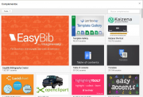

Google drive/Complementos y combinaciones de teclas en Documentos de Google {#firstHeading .firstHeading lang="es"}

De WikiEducator

&lt; [Google
drive](/Google_drive "Google drive")

Saltar a: [navegación](#mw-navigation), [buscar](#p-search)

[Editando un
Documento](/Google_drive/Introducci%C3%B3n_a_Documentos_de_Google "Google drive/Introducción a Documentos de Google")
 |  [El menú
insertar](/Google_drive/El_men%C3%BA_insertar_en_Documentos_de_Google "Google drive/El menú insertar en Documentos de Google")
 |  [El menú
herramientas](/Google_drive/El_men%C3%BA_herramientas_en_Documentos_de_Google "Google drive/El menú herramientas en Documentos de Google")
 |  **Complementos y combinaciones de teclas**  | 
[Colaborando](/Google_drive/Colaborando_con_Documentos_de_Google "Google drive/Colaborando con Documentos de Google")

\

\

Complementos y
combinaciones de teclas

Añade más funcionalidades a tus Documentos de Google obteniendo
complementos. Los complementos son extensiones elaboradas por terceras
partes que puedes añadir a tus aplicaciones Documentos, Hojas de
Cálculo, Formularios y Presentaciones, siendo algunas de ellas de
extremada utilidad.

### Añadir complemento

{.thumbimage

Complementos de Documentos de Google

Clica en *Obtener complementos...* y verás una ventana con con todos los
complementos disponibles. Pasa el ratón por encima de cada una y verás
una breve descripción. Si quieres más información, capturas de pantalla
e incluso vídeos sobre su funcionamiento, clica sobre la imagen. ¿Te
gusta? Añádelo a tu colección pulsando en + Gratis (casi todos son
gratuitos).

Una vez añadido podrás acceder a él desde el menú **Complementos**.
También podrás administrar tu colección, eliminando los que ya no te
interesen.

### Combinaciones de teclas

Si con el tiempo y las horas de uso te vas convirtiendo en un experto,
aprovecha el potencial de los atajos de teclado. Vienen reseñados a la
derecha de cada opción en los distintos menús, pero puedes acceder a
todas las combinaciones de teclas a través del menú **Ayuda** -
**Combinaciones de teclas**, o también usando Ctrl+/.

[Editando un
Documento](/Google_drive/Introducci%C3%B3n_a_Documentos_de_Google "Google drive/Introducción a Documentos de Google")
 |  [El menú
insertar](/Google_drive/El_men%C3%BA_insertar_en_Documentos_de_Google "Google drive/El menú insertar en Documentos de Google")
 |  [El menú
herramientas](/Google_drive/El_men%C3%BA_herramientas_en_Documentos_de_Google "Google drive/El menú herramientas en Documentos de Google")
 |  **Complementos y combinaciones de teclas**  | 
[Colaborando](/Google_drive/Colaborando_con_Documentos_de_Google "Google drive/Colaborando con Documentos de Google")

\

Obtenido de
«<http://es.wikieducator.org/index.php?title=Google_drive/Complementos_y_combinaciones_de_teclas_en_Documentos_de_Google&oldid=19155>»

