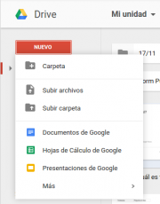

{#top}

Google drive/Creación y gestión de archivos en Google Drive {#firstHeading .firstHeading lang="es"}
===================================================================================

De WikiEducator

&lt; [Google
drive](/Google_drive "Google drive")

Saltar a: [navegación](#mw-navigation), [buscar](#p-search)

[Introducción](/Google_drive/Introducci%C3%B3n "Google drive/Introducción")
 |  [Primeros
pasos](/Google_drive/Primeros_pasos "Google drive/Primeros pasos")  | 
**Creación y gestión de archivos**  |  [Compartir y
colaborar](/Google_drive/Compartir_y_colaborar_en_Google_Drive "Google drive/Compartir y colaborar en Google Drive")
 |  [Para ordenador y
móvil](/Google_drive/Google_Drive_para_ordenador_y_m%C3%B3vil "Google drive/Google Drive para ordenador y móvil")

\

\

Creando documentos
---------------------------------------------------------------------------

[{.thumbimage width="180"
height="230"
srcset="/images/thumb/5/51/Nuevo_en_Google_Drive.png/270px-Nuevo_en_Google_Drive.png 1.5x, /images/5/51/Nuevo_en_Google_Drive.png 2x"}](/Archivo:Nuevo_en_Google_Drive.png){.image}

[{width="15"
height="11"}](/Archivo:Nuevo_en_Google_Drive.png "Aumentar"){.internal}

Nuevo en Google Drive

¡Creemos nuestro primer documento! Clica en **Nuevo** para escoger qué
tipo de archivo quieres crear. También podrás crear una carpeta nueva
para organizar tus documentos o subir varios archivos o carpetas de
golpe.
El archivo aparecerá en una ventana nueva. Le damos un nombre clicando
sobre *Documento sin título* en la esquina superior izquierda y ya
podemos comenzar a editarlo. Justo al lado del título del documento
podremos seleccionar la carpeta donde queremos guardarlo. Si
seleccionamos ninguna, nuestro archivo se guarda automáticamente en "Mi
unidad".

\

[{width="500"
height="117"
srcset="/images/thumb/8/8c/Cambiando_t%C3%ADtulo_de_un_documento_Google_Drive.png/750px-Cambiando_t%C3%ADtulo_de_un_documento_Google_Drive.png 1.5x, /images/8/8c/Cambiando_t%C3%ADtulo_de_un_documento_Google_Drive.png 2x"}](/Archivo:Cambiando_t%C3%ADtulo_de_un_documento_Google_Drive.png "Cambiando título de un documento Google Drive"){.image}

\

Subiendo documentos
-----------------------------------------------------------------------------

También podemos subir nuestros propios documentos creados con otros
programas. Una vez subidos podremos organizarlos, compartirlos, acceder
desde cualquier sitio y editar muchos de ellos.

No hay límite en el número de archivos que puedes almacenar. Solo se
establece una **limitación de espacio de 15 GB en total**, contando en
esta cuota los archivos guardados en *Mi unidad*, Google Fotos y los
mails de Gmail. No ocuparán espacio en tu Drive los archivos
*Compartidos conmigo* que NO hayas añadido a *Mi unidad*.

Puedes subir tus archivos clicando en **Nuevo** y **Subir archivos** o
**Subir carpeta**. Otra opción es **arrastrar** tus archivos sobre la
ventana del navegador donde tengas abierta tu unidad de Drive.

\

[{width="600"
height="312"
srcset="/images/thumb/d/dc/Subir_arrastrando_a_Drive.svg/900px-Subir_arrastrando_a_Drive.svg.png 1.5x, /images/thumb/d/dc/Subir_arrastrando_a_Drive.svg/1200px-Subir_arrastrando_a_Drive.svg.png 2x"}](/Archivo:Subir_arrastrando_a_Drive.svg "Subir archivos y carpetas arrastrando en Google Drive"){.image}

Editando documentos subidos
---------------------------------------------------------------------------------------------

Google Drive puede abrir documentos realizados con Microsoft Office y
suites ofimáticas libres como LibreOffice. Una vez subidos los archivos
a nuestro Drive clica con el botón derecho sobre el archivo y
posteriormente "Abrir con". Si seleccionas el programa propio de Google
-Documentos para .docx y .odt, Hojas de Calculo para .xls y .ods...-
podrás editar utilizando todas opciones que proporciona Google. También
se puede "Abrir con" desde la previsualización de los archivos.

[{.thumbimage
width="180" height="122"
srcset="/images/thumb/1/16/Complementos_de_Documentos_de_Google.png/270px-Complementos_de_Documentos_de_Google.png 1.5x, /images/thumb/1/16/Complementos_de_Documentos_de_Google.png/360px-Complementos_de_Documentos_de_Google.png 2x"}](/Archivo:Complementos_de_Documentos_de_Google.png){.image}

[{width="15"
height="11"}](/Archivo:Complementos_de_Documentos_de_Google.png "Aumentar"){.internal}

Complementos de Documentos de Google

[{width="300"
height="126"
srcset="/images/thumb/d/d5/Documento_no_editable_con_Documentos_de_Google.png/450px-Documento_no_editable_con_Documentos_de_Google.png 1.5x, /images/thumb/d/d5/Documento_no_editable_con_Documentos_de_Google.png/600px-Documento_no_editable_con_Documentos_de_Google.png 2x"}](/Archivo:Documento_no_editable_con_Documentos_de_Google.png "Documento no editable con Documentos de Google"){.image}
[{width="300"
height="136"
srcset="/images/thumb/f/f1/Documento_editable_con_Documentos_de_Google.png/450px-Documento_editable_con_Documentos_de_Google.png 1.5x, /images/thumb/f/f1/Documento_editable_con_Documentos_de_Google.png/600px-Documento_editable_con_Documentos_de_Google.png 2x"}](/Archivo:Documento_editable_con_Documentos_de_Google.png "Documento editable con Documentos de Google"){.image}

Cuando ganes experiencia comprobarás que tienes una oferta enorme de
aplicaciones para utilizar con los documentos de tu Drive. Explóralas en
"Conectar más aplicaciones".

\

[Introducción](/Google_drive/Introducci%C3%B3n "Google drive/Introducción")
 |  [Primeros
pasos](/Google_drive/Primeros_pasos "Google drive/Primeros pasos")  | 
**Creación y gestión de archivos**  |  [Compartir y
colaborar](/Google_drive/Compartir_y_colaborar_en_Google_Drive "Google drive/Compartir y colaborar en Google Drive")
 |  [Para ordenador y
móvil](/Google_drive/Google_Drive_para_ordenador_y_m%C3%B3vil "Google drive/Google Drive para ordenador y móvil")

\

Obtenido de
«[http://es.wikieducator.org/index.php?title=Google\_drive/Creación\_y\_gestión\_de\_archivos\_en\_Google\_Drive&oldid=19041](http://es.wikieducator.org/index.php?title=Google_drive/Creaci%C3%B3n_y_gesti%C3%B3n_de_archivos_en_Google_Drive&oldid=19041)»

