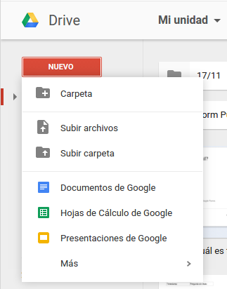
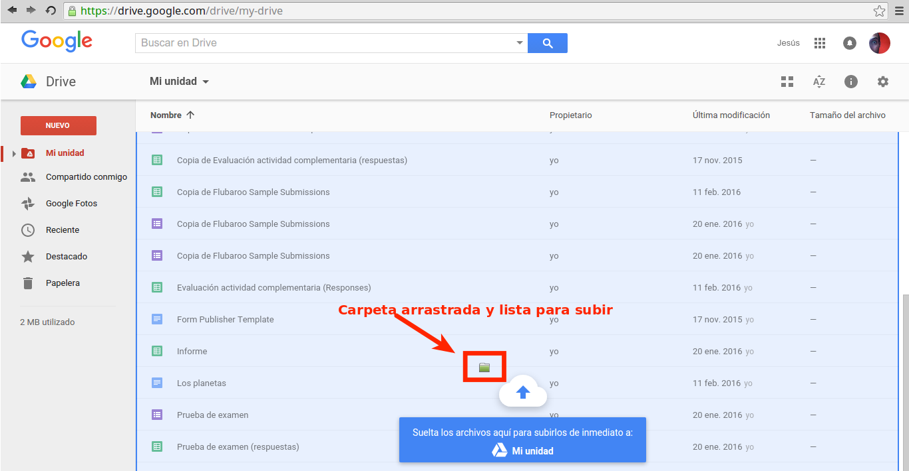
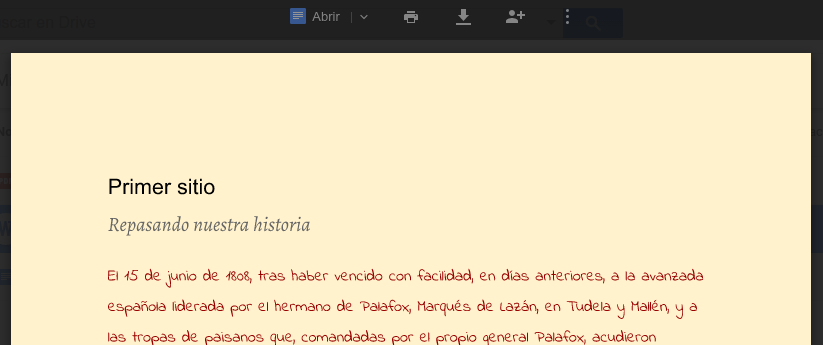
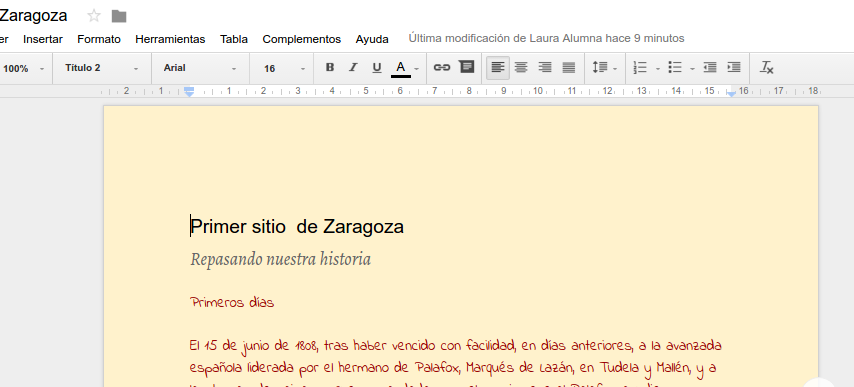

## Creando documentos

¡Creemos nuestro primer documento! Clica en **Nuevo** para escoger qué
tipo de archivo quieres crear. También podrás crear una carpeta nueva
para organizar tus documentos o subir varios archivos o carpetas de
golpe.
El archivo aparecerá en una ventana nueva. Le damos un nombre clicando
sobre *Documento sin título* en la esquina superior izquierda y ya
podemos comenzar a editarlo. Justo al lado del título del documento
podremos seleccionar la carpeta donde queremos guardarlo. Si
seleccionamos ninguna, nuestro archivo se guarda automáticamente en "Mi
unidad".

## Subiendo documentos

También podemos subir nuestros propios documentos creados con otros
programas. Una vez subidos podremos organizarlos, compartirlos, acceder
desde cualquier sitio y editar muchos de ellos.

No hay límite en el número de archivos que puedes almacenar. Solo se
establece una **limitación de espacio de 15 GB en total**, contando en
esta cuota los archivos guardados en *Mi unidad*, Google Fotos y los
mails de Gmail. No ocuparán espacio en tu Drive los archivos
*Compartidos conmigo* que NO hayas añadido a *Mi unidad*.

Puedes subir tus archivos clicando en **Nuevo** y **Subir archivos** o
**Subir carpeta**. Otra opción es **arrastrar** tus archivos sobre la
ventana del navegador donde tengas abierta tu unidad de Drive.

## Editando documentos subidos

Google Drive puede abrir documentos realizados con Microsoft Office y
suites ofimáticas libres como LibreOffice. Una vez subidos los archivos
a nuestro Drive clica con el botón derecho sobre el archivo y
posteriormente "Abrir con". Si seleccionas el programa propio de Google
-Documentos para .docx y .odt, Hojas de Calculo para .xls y .ods...-
podrás editar utilizando todas opciones que proporciona Google. También
se puede "Abrir con" desde la previsualización de los archivos.

Cuando ganes experiencia comprobarás que tienes una oferta enorme de
aplicaciones para utilizar con los documentos de tu Drive. Explóralas en
"Conectar más aplicaciones".