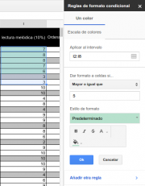

{#top}

Google drive/Dando formato a Hojas de Calculo en Google Drive {#firstHeading .firstHeading lang="es"}
=====================================================================================

De WikiEducator

&lt; [Google
drive](/Google_drive "Google drive")

Saltar a: [navegación](#mw-navigation), [buscar](#p-search)

[Introducción a Hojas de
Cálculo](/Google_drive/Introducci%C3%B3n_a_Hojas_de_C%C3%A1lculo_de_Google "Google drive/Introducción a Hojas de Cálculo de Google")
 |  [Introduciendo
datos](/Google_drive/Introduciendo_datos_en_Hojas_de_C%C3%A1lculo_de_Google "Google drive/Introduciendo datos en Hojas de Cálculo de Google")
 | 
[Editando](/Google_drive/Editando_Hojas_de_C%C3%A1lculo_de_Google_Drive "Google drive/Editando Hojas de Cálculo de Google Drive")
 |  **Dando formato**  |  [Fórmulas y
funciones](/Google_drive/F%C3%B3rmulas_y_funciones_en_Hojas_de_Calculo_en_Google_Drive "Google drive/Fórmulas y funciones en Hojas de Calculo en Google Drive")
 | [Ordena, filtra y
colabora](/Google_drive/Colaborando_con_Hojas_de_C%C3%A1lculo_de_Google "Google drive/Colaborando con Hojas de Cálculo de Google")

\

\
La forma en la que visualizamos los datos es fundamental para que éstos
sean significativos, para que nos digan algo de forma sencilla y clara.
A continuación verás cómo cuidar el formato de las hojas de cálculo que
edites.

Formato de la celda
-----------------------------------------------------------------------------

[{.thumbimage width="180"
height="231"
srcset="/images/thumb/b/b4/Formato_condicional.png/270px-Formato_condicional.png 1.5x, /images/thumb/b/b4/Formato_condicional.png/360px-Formato_condicional.png 2x"}](/Archivo:Formato_condicional.png){.image}

[{width="15"
height="11"}](/Archivo:Formato_condicional.png "Aumentar"){.internal}

Formato condicional

Seleccionar qué **tipo de dato** está recogiendo cada rango de celdas
nos facilitará mucho el posterior manejo de los datos. Para ello,
selecciona el rango de celdas (conjunto de celdas) que vayan a contener
el mismo tipo de dato -fecha, moneda...- y aplícalo. Puedes acceder a
las distintas opciones a través de la barra de herramientas o desde el
menú *Formato*.
Otra herramienta extremadamente útil es la de **Formato condicional**.
Imagina que tienes un hoja de notas de tus alumnos y quieres que se
resalten en color verde los aprobados. Seleccionando un rango de celdas
y clicando sobre ellas con el botón derecho, puedes establecer ese
formato para el fondo de la celda si la nota es igual o superior a 5.
Esto es solo un ejemplo de las múltiples posibilidades tienes a tu
disposición.

Fuentes y fondo
---------------------------------------------------------------------

Al igual que ocurre en el procesador de textos, a través de la barra de
herramientas tienes acceso a las principales opciones de formato para
texto y fondo de la celda.

[{width="314"
height="35"}](/Archivo:Formato_de_texto_y_celda_en_Hojas_de_C%C3%A1lculo.png "Formato de texto y celda en Hojas de Cálculo"){.image}

Bordes
---------------------------------------------------

Para resaltar los bordes de las celdas, el botón de la barra de
herramientas [{width="17"
height="15"}](/Archivo:Bordes.png "Configurar bordes"){.image} nos
ofrece las siguientes opciones:

-   Elegir qué lados queremos resaltar (interiores verticales,
    exteriores, superiores...)
-   Elegir el color de la línea.
-   Elegir el tipo de trazo.

Imprimir
-------------------------------------------------------

Como suele ocurrir, para imprimir podemos clicar en el icono
correspondiente o pulsar Ctrl+p. En el caso de Hojas de Cálculo, nos
aparecerá un cuadro específico de configuración de la impresión.
Conviene dedicar tiempo a probar las distintas opciones. El problema
principal al imprimir hojas de cálculo es que éstas se ajusten al tamaño
del papel. Para ello, en el apartado *Diseño*, selecciona las opciones
más convenientes.

Si quieres que en la impresión aparezcan solo aquellos bordes que hayas
resaltado, no olvides marcar la casilla 'Sin lineas de cuadrícula'.

[{width="606"
height="564"}](/Archivo:Imprimir_una_hoja_de_c%C3%A1lculo_de_Google.png "Imprimir una hoja de cálculo de Google"){.image}

Una vez configurada la impresión, llegarás al cuadro que ya vimos en el
[segundo
módulo](http://es.wikieducator.org/Google_drive/Introducci%C3%B3n_a_Documentos_de_Google#Imprimir%7C){.external
.text}.

[Introducción a Hojas de
Cálculo](/Google_drive/Introducci%C3%B3n_a_Hojas_de_C%C3%A1lculo_de_Google "Google drive/Introducción a Hojas de Cálculo de Google")
 |  [Introduciendo
datos](/Google_drive/Introduciendo_datos_en_Hojas_de_C%C3%A1lculo_de_Google "Google drive/Introduciendo datos en Hojas de Cálculo de Google")
 | 
[Editando](/Google_drive/Editando_Hojas_de_C%C3%A1lculo_de_Google_Drive "Google drive/Editando Hojas de Cálculo de Google Drive")
 |  **Dando formato**  |  [Fórmulas y
funciones](/Google_drive/F%C3%B3rmulas_y_funciones_en_Hojas_de_Calculo_en_Google_Drive "Google drive/Fórmulas y funciones en Hojas de Calculo en Google Drive")
 | [Ordena, filtra y
colabora](/Google_drive/Colaborando_con_Hojas_de_C%C3%A1lculo_de_Google "Google drive/Colaborando con Hojas de Cálculo de Google")

\

Obtenido de
«<http://es.wikieducator.org/index.php?title=Google_drive/Dando_formato_a_Hojas_de_Calculo_en_Google_Drive&oldid=19212>»

