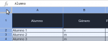
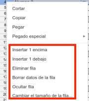

{#top}

Google drive/Editando Hojas de Cálculo de Google Drive {#firstHeading .firstHeading lang="es"}
==============================================================================

De WikiEducator

&lt; [Google
drive](/Google_drive "Google drive")

Saltar a: [navegación](#mw-navigation), [buscar](#p-search)

[Introducción a Hojas de
Cálculo](/Google_drive/Introducci%C3%B3n_a_Hojas_de_C%C3%A1lculo_de_Google "Google drive/Introducción a Hojas de Cálculo de Google")
 |  [Introduciendo
datos](/Google_drive/Introduciendo_datos_en_Hojas_de_C%C3%A1lculo_de_Google "Google drive/Introduciendo datos en Hojas de Cálculo de Google")
 |  **Editando**  |  [Dando
formato](/Google_drive/Dando_formato_a_Hojas_de_Calculo_en_Google_Drive "Google drive/Dando formato a Hojas de Calculo en Google Drive")
 |  [Fórmulas y
funciones](/Google_drive/F%C3%B3rmulas_y_funciones_en_Hojas_de_Calculo_en_Google_Drive "Google drive/Fórmulas y funciones en Hojas de Calculo en Google Drive")
 | [Ordena, filtra y
colabora](/Google_drive/Colaborando_con_Hojas_de_C%C3%A1lculo_de_Google "Google drive/Colaborando con Hojas de Cálculo de Google")

\

\

{width="209" height="178"}

editando Hojas
de Cálculo

Modificando el ancho y la altura de columnas, filas y celdas
-----------------------------------------------------------------------------------------------------------------------------------------------------------------

Si pasas el cursor por las letras y números de columnas y filas, verás
que cuando te sitúas en el límite entre dos tu cursor se transforma en
una doble flecha. Mantén pulsado entonces y arrastra el límite a tu
gusto.

[{width="600"
height="230"}](/Archivo:Ajustando_ancho_de_columnas.png "Ajustando ancho de columnas"){.image}

[{.thumbimage
width="180" height="69"
srcset="/images/thumb/f/f8/Seleccionando_toda_la_hoja_de_c%C3%A1lculo.png/270px-Seleccionando_toda_la_hoja_de_c%C3%A1lculo.png 1.5x, /images/thumb/f/f8/Seleccionando_toda_la_hoja_de_c%C3%A1lculo.png/360px-Seleccionando_toda_la_hoja_de_c%C3%A1lculo.png 2x"}](/Archivo:Seleccionando_toda_la_hoja_de_c%C3%A1lculo.png){.image}

[{width="15"
height="11"}](/Archivo:Seleccionando_toda_la_hoja_de_c%C3%A1lculo.png "Aumentar"){.internal}

Seleccionando toda la hoja de cálculo

En el caso de las columnas, si al ver la doble flecha clicas dos veces,
el ancho se ajustará al de los datos contenidos.
¿Quieres dar el mismo tamaño a un grupo de filas o columnas?
Selecciónalas clicando y arrastrando sobre sus números/letras
correspondientes. Después sigue el procedimiento descrito anteriormente
y el ancho/alto seleccionado se replicará en todos. Puedes también hacer
esto para todo el documento seleccionando la intersección superior
izquierda tal y como se muestra en la siguiente imagen.

Añade, borra y mueve filas y columnas
------------------------------------------------------------------------------------------------------------------------

[{.thumbimage
width="180" height="205"
srcset="/images/8/81/A%C3%B1adir_y_eliminar_filas_y_columnas.png 1.5x, /images/8/81/A%C3%B1adir_y_eliminar_filas_y_columnas.png 2x"}](/Archivo:A%C3%B1adir_y_eliminar_filas_y_columnas.png){.image}

[{width="15"
height="11"}](/Archivo:A%C3%B1adir_y_eliminar_filas_y_columnas.png "Aumentar"){.internal}

Añadir y eliminar filas y columnas

Para **añadir** filas y columnas clica sobre una de ellas con el botón
derecho y selecciona *Insertar 1*. Para **borrar** una, selecciónala y
pulsa en *Eliminar...*. También puedes borrar solo el contenido de la
fila o columna. Para ello clica en *Borrar datos de la fila*, en el menú
contextual de las filas, o en *Borrar columna* para la opción vertical.
¿Quieres insertar más de una a la vez? Selecciona el número de
filas/columnas que desees y repite los pasos anteriores.

**Mueve** las filas/columnas de sitio arrastrándolas. Pasa el cursor
sobre sus números/letras y, cuando el cursor se transforme en mano,
arrástralas al lugar deseado.

Ajustando el texto y combinando celdas
-------------------------------------------------------------------------------------------------------------------

Siempre que una celda de texto tenga contenido demasiado largo para ser
mostrado al completo tendrás que elegir entre dos opciones: ajustar el
texto o combinar varias celdas. La opción **Ajuste de texto** (menú
*Formato* - *Ajuste de texto* o [{width="19"
height="14"}](/Archivo:Ajustar_texto.png "Botón de Ajustar Texto"){.image})
modificará automáticamente la altura de la celda, permitiendo que el
contenido se muestre en varias líneas. La opción **Combinar celdas** te
permite unir celdas adyacentes para que formen una sola. Este proceso se
puede revertir clicando en el mismo botón de la barra de la barra de
herramientas [{width="21"
height="16"}](/Archivo:Combinar_celdas.png "Icono combinar celdas"){.image}.
Recuerda que para poder utilizar este botón debes seleccionar
previamente las celdas a combinar o la celda a separar.

Inmovilizando filas y columnas
---------------------------------------------------------------------------------------------------

Imagina que tienes una gran cantidad de datos. Quieres avanzar por la
hoja de cálculo sin perder de vista la primera fila, donde tienes
escrito el concepto al que responde cada dato en los sucesivos
registros. Pues bien, pues hacer esto tanto en filas como en columnas
con la opción del menú *Ver*-*Inmovilizar*.

Selecciona una de la fila o columna que marque el límite del rango que
quieres inmovilizar y a continuación clica en
*Ver*-*Inmovilizar*-*opción correspondiente*.

[{width="434"
height="277"}](/Archivo:Inmovilizar_filas_y_columnas.png "Inmovilizar filas y columnas"){.image}

[Introducción a Hojas de
Cálculo](/Google_drive/Introducci%C3%B3n_a_Hojas_de_C%C3%A1lculo_de_Google "Google drive/Introducción a Hojas de Cálculo de Google")
 |  [Introduciendo
datos](/Google_drive/Introduciendo_datos_en_Hojas_de_C%C3%A1lculo_de_Google "Google drive/Introduciendo datos en Hojas de Cálculo de Google")
 |  **Editando**  |  [Dando
formato](/Google_drive/Dando_formato_a_Hojas_de_Calculo_en_Google_Drive "Google drive/Dando formato a Hojas de Calculo en Google Drive")
 |  [Fórmulas y
funciones](/Google_drive/F%C3%B3rmulas_y_funciones_en_Hojas_de_Calculo_en_Google_Drive "Google drive/Fórmulas y funciones en Hojas de Calculo en Google Drive")
 | [Ordena, filtra y
colabora](/Google_drive/Colaborando_con_Hojas_de_C%C3%A1lculo_de_Google "Google drive/Colaborando con Hojas de Cálculo de Google")

\

Obtenido de
«[http://es.wikieducator.org/index.php?title=Google\_drive/Editando\_Hojas\_de\_Cálculo\_de\_Google\_Drive&oldid=19493](http://es.wikieducator.org/index.php?title=Google_drive/Editando_Hojas_de_C%C3%A1lculo_de_Google_Drive&oldid=19493)»

