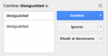
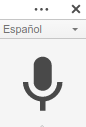

Google drive/El menú herramientas en Documentos de Google {#firstHeading .firstHeading lang="es"}

De WikiEducator

&lt; [Google
drive](/Google_drive "Google drive")

Saltar a: [navegación](#mw-navigation), [buscar](#p-search)

[Editando un
Documento](/Google_drive/Introducci%C3%B3n_a_Documentos_de_Google "Google drive/Introducción a Documentos de Google")
 |  [El menú
insertar](/Google_drive/El_men%C3%BA_insertar_en_Documentos_de_Google "Google drive/El menú insertar en Documentos de Google")
 |  **El menú herramientas**  |  [Complementos y combinaciones de
teclas](/Google_drive/Complementos_y_combinaciones_de_teclas_en_Documentos_de_Google "Google drive/Complementos y combinaciones de teclas en Documentos de Google")
 | 
[Colaborando](/Google_drive/Colaborando_con_Documentos_de_Google "Google drive/Colaborando con Documentos de Google")

\

\

El menú
herramientas

Otro menú muy potente es el de **Herramientas**. Desde él podremos:

-   Comprobar la ortografía de nuestro documento en múltiples idiomas.
-   Investigar sobre un concepto o nombre propio sin salir de
    nuestra ventana.
-   Buscar definiciones desde el propio documento.
-   Contar las páginas, palabras, caracteres y caracteres sin espacios
    de nuestro texto.
-   Dictarle a Google para que escriba por nosotros.
-   Traducir nuestro texto a otro idioma.
-   Consultar y editar ciertas sustituciones de texto, por ejemplo (C)
    por ©.
-   Consultar y editar nuestro diccionario personal.

### Ortografía...

{.thumbimage

Comprobando ortografía en Documentos de Google

Repasa la ortografía de tu documento en diferentes idiomas gracias a
esta sencilla herramienta. Sustituye las palabras por las propuestas por
el corrector, ignora la sugerencia de corrección o -si está bien
escrita- añádela a tu diccionario para que no la vuelva a dar por mala.
### Investigar

¿Quieres saber más sobre un personaje reseñado en tu texto? No pierdas
el tiempo abriendo otra pestaña para iniciar una búsqueda. Selecciona el
texto y clica en **Investigar** (Ctrl+Alt+Mayus+I). A la derecha
aparecerá información relacionada con tu búsqueda. Filtra además tu
búsqueda por imágenes, citas o busca dentro de tus documentos
personales.

### Definir

Ya seas estudiante de idiomas o un amante de tu lengua materna ávido de
conocimiento, esta herramienta te va a encantar. Selecciona cualquier
palabra y clica en **Definir** (Ctrl+Mayus+Y). Podrás buscar en
diccionarios de casi cualquier idioma.

height="127"}](/Archivo:Hablando_a_Documentos_de_Google.png){.image}

Hablando a Documentos de Google

### Escritura por voz

Para poder utilizar esta opción deberemos permitir a nuestro navegador
el acceso al micrófono. A continuación nos aparecerá una ventana
emergente. Clicamos sobre el símbolo del micrófono y... ¡a dictar!
Presta atención al ruido de tu entorno y al micrófono que utilizas.
Necesitas un ambiente silencioso para que esta opción funcione
correctamente.

[Editando un
Documento](/Google_drive/Introducci%C3%B3n_a_Documentos_de_Google "Google drive/Introducción a Documentos de Google")
 |  [El menú
insertar](/Google_drive/El_men%C3%BA_insertar_en_Documentos_de_Google "Google drive/El menú insertar en Documentos de Google")
 |  **El menú herramientas**  |  [Complementos y combinaciones de
teclas](/Google_drive/Complementos_y_combinaciones_de_teclas_en_Documentos_de_Google "Google drive/Complementos y combinaciones de teclas en Documentos de Google")
 | 
[Colaborando](/Google_drive/Colaborando_con_Documentos_de_Google "Google drive/Colaborando con Documentos de Google")

\

Obtenido de
«[http://es.wikieducator.org/index.php?title=Google\_drive/El\_menú\_herramientas\_en\_Documentos\_de\_Google&oldid=19154](http://es.wikieducator.org/index.php?title=Google_drive/El_men%C3%BA_herramientas_en_Documentos_de_Google&oldid=19154)»

