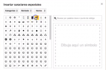
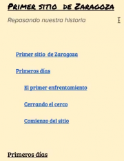

Google drive/El menú insertar en Documentos de Google {#firstHeading .firstHeading lang="es"}

De WikiEducator

&lt; [Google
drive](/Google_drive "Google drive")

Saltar a: [navegación](#mw-navigation), [buscar](#p-search)

[Editando un
Documento](/Google_drive/Introducci%C3%B3n_a_Documentos_de_Google "Google drive/Introducción a Documentos de Google")
 |  **El menú insertar**  |  [El menú
herramientas](/Google_drive/El_men%C3%BA_herramientas_en_Documentos_de_Google "Google drive/El menú herramientas en Documentos de Google")
 |  [Complementos y combinaciones de
teclas](/Google_drive/Complementos_y_combinaciones_de_teclas_en_Documentos_de_Google "Google drive/Complementos y combinaciones de teclas en Documentos de Google")
 | 
[Colaborando](/Google_drive/Colaborando_con_Documentos_de_Google "Google drive/Colaborando con Documentos de Google")

\

\

El menú
insertar

Merece especial atención el menú insertar y todas las posibilidades que
nos ofrece. Clicando sobre él podrás insertar imágenes, enlaces,
ecuaciones... y mucho más. Vayamos por partes:

Las imagenes y sus opciones
---------------------------------------------------------------------------------------------

{.thumbimage

height="251"}](/Archivo:Opciones_de_edici%C3%B3n_de_la_imagen.png){.image}

Opciones de edición de la imagen

Al **insertar una imagen**, Google nos ofrece múltiples opciones: subir
una imagen, hacer una foto con nuestra webcam, insertar desde url o
añadirla desde tus álbumes guardados en Google Fotos o en tu Drive. Otra
opción muy interesante es la de **Búsqueda**, que nos ofrece
directamente imágenes que pueden reutilizarse con modificaciones para
fines comerciales; una licencia libre de las más permisivas. En el
siguiente paso podremos incluso seleccionar el color predominante que
queremos en nuestra imagen y el tipo (Cara, Fotografía, dibujo de
líneas...).

Clica sobre la imagen y accede a más herramientas de gran utilidad. Echa
un ojo a la imagen de la derecha.

Si no encuentras la imagen que quieres, ¡créala tú!
----------------------------------------------------------------------------------------------------------------------------------------------------------------

La herramienta dibujo nos abre una ventana dentro del propio documento
donde crear nuestra imagen desde cero o trabajar sobre imágenes ya
existentes.

Sácale partido a los *Caracteres especiales*
----------------------------------------------------------------------------------------------------------------------------------

{.thumbimage

Caracteres especiales en Documentos de Google

En tus Documentos tienes la posibilidad de utilizar caracteres de todo
tipo como parte del texto. La herramienta *Caracteres especiales* nos
ofrece desde caracteres árabes hasta musicales de todas las épocas y
culturas. ¿No encuentras el que quieres? Búscalo por palabra clave o
dibújalo para Google lo reconozca. A continuación tienes unos cuantos
ejemplos.
Crea tu índice
------------------------------------------------------------------------

Como vimos en el [punto
anterior](/Google_drive/Introducci%C3%B3n_a_Documentos_de_Google "Google drive/Introducción a Documentos de Google"),
es importante que selecciones con cuidado que tipo de texto estás
escribiendo (Título 1, subtítulo...). Si has hecho esto en todo tu
documento, podrás generar un índice de forma automática. Sitúa el cursor
donde quieras que se inserte y clica en *Índice*. ¡Listo! Podrás acceder
a cada apartado de tu documento clicando en el item del índice
correspondiente.

{.thumbimage

Generando un índice en Documentos de Google

\

[Editando un
Documento](/Google_drive/Introducci%C3%B3n_a_Documentos_de_Google "Google drive/Introducción a Documentos de Google")
 |  **El menú insertar**  |  [El menú
herramientas](/Google_drive/El_men%C3%BA_herramientas_en_Documentos_de_Google "Google drive/El menú herramientas en Documentos de Google")
 |  [Complementos y combinaciones de
teclas](/Google_drive/Complementos_y_combinaciones_de_teclas_en_Documentos_de_Google "Google drive/Complementos y combinaciones de teclas en Documentos de Google")
 | 
[Colaborando](/Google_drive/Colaborando_con_Documentos_de_Google "Google drive/Colaborando con Documentos de Google")

\

Obtenido de
«[http://es.wikieducator.org/index.php?title=Google\_drive/El\_menú\_insertar\_en\_Documentos\_de\_Google&oldid=19144](http://es.wikieducator.org/index.php?title=Google_drive/El_men%C3%BA_insertar_en_Documentos_de_Google&oldid=19144)»

