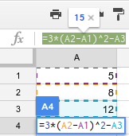

{#top}

Google drive/Fórmulas y funciones en Hojas de Calculo en Google Drive {#firstHeading .firstHeading lang="es"}
=============================================================================================

De WikiEducator

&lt; [Google
drive](/Google_drive "Google drive")

Saltar a: [navegación](#mw-navigation), [buscar](#p-search)

[Introducción a Hojas de
Cálculo](/Google_drive/Introducci%C3%B3n_a_Hojas_de_C%C3%A1lculo_de_Google "Google drive/Introducción a Hojas de Cálculo de Google")
 |  [Introduciendo
datos](/Google_drive/Introduciendo_datos_en_Hojas_de_C%C3%A1lculo_de_Google "Google drive/Introduciendo datos en Hojas de Cálculo de Google")
 | 
[Editando](/Google_drive/Editando_Hojas_de_C%C3%A1lculo_de_Google_Drive "Google drive/Editando Hojas de Cálculo de Google Drive")
 |  [Dando
formato](/Google_drive/Dando_formato_a_Hojas_de_Calculo_en_Google_Drive "Google drive/Dando formato a Hojas de Calculo en Google Drive")
 |  **Fórmulas y funciones**  | [Ordena, filtra y
colabora](/Google_drive/Colaborando_con_Hojas_de_C%C3%A1lculo_de_Google "Google drive/Colaborando con Hojas de Cálculo de Google")

\

\

Gracias a las fórmulas y funciones podemos manejar los datos de manera
eficiente. Sin éstas, nuestras hojas de cálculo serían como documentos
de texto. Veamos la definición de cada una:

-   **Fórmulas**: expresiones matemáticas que, escritas en una celda,
    devuelven el resultado requerido en la propia celda.
-   **Funciones**: *Una función es una fórmula predefinida que realiza
    los cálculos utilizando valores específicos en un orden particular.
    Una de las principales ventajas es que ahorran tiempo porque ya no
    es necesario que la escribas tú mismo.* [Fuente:
    www.gcfaprendelibre.org](http://www.gcfaprendelibre.org/tecnologia/curso/microsoft_excel_2010/explora_las_funciones_basicas_de_excel_2010/1.do){.external
    .text}

A continuación profundizaremos en la utilización de cada una.

Creando fórmulas
----------------------------------------------------------------------------

Toda fórmula comienza con el símbolo = seguido de una expresión
matemática. En dicha expresión utilizaremos casi siempre números
mezclados con referencias a otras celdas para realizar nuestros
cálculos. Los operadores matemáticos disponibles son los siguientes:

-   Suma +
-   Resta -
-   Multiplicación \*
-   División /
-   Exponente \^

Por supuesto, la complejidad de las funciones a utilizar puede variar.
Si vamos a crear fórmulas más complejas conviene recordar el orden de
las operaciones:

1.  Operaciones limitadas por paréntesis.
2.  Potencias.
3.  Multiplicaciones y divisiones.
4.  Suma y resta.

Recuerda que, ante operaciones del mismo nivel, éstas se realizan de
izquierda a derecha.

[{.thumbimage width="162"
height="171"}](/Archivo:Creando_f%C3%B3rmulas.png){.image}

[{width="15"
height="11"}](/Archivo:Creando_f%C3%B3rmulas.png "Aumentar"){.internal}

Ejemplo de fórmula

Vamos con un ejemplo sencillo. En las celdas A1, A2 y A3 tienes los
valores 5 8 y 12 respectivamente. ¿Cuál sería el resultado de la
siguiente fórmula escrita en A4? =3\*(A2-A1)\^2-A3. Vayamos por partes:
-   A2-A1 = 3
-   3\^2 = 9
-   3\*9 = 27
-   27-A3 = 15

**Un consejo**: no hace falta que escribas A2 cuando te toque ponerla en
la función; clica sobre la celda y se incluirá automáticamente. En la
imagen de la derecha puedes ver el ejemplo sobre la propia hoja de
cálculo.

Funciones
---------------------------------------------------------

[{width="200"
height="81"
srcset="/images/thumb/a/a1/Elementos_de_una_funci%C3%B3n.png/300px-Elementos_de_una_funci%C3%B3n.png 1.5x, /images/a/a1/Elementos_de_una_funci%C3%B3n.png 2x"}](/Archivo:Elementos_de_una_funci%C3%B3n.png "Elementos de una función"){.image}

Una función, al igual que las fórmulas, debe empezar con un signo =.
Escribe después el nombre de la función y los argumentos, éstos últimos
entre paréntesis. ¡Habrás creado tu primera función! Los valores o las
celdas dentro de los paréntesis van separadas por *dos puntos*(:) o
*punto y coma*(;).

[{width="350"
height="103"
srcset="/images/1/12/Seleccionando_celdas_en_funciones.png 1.5x, /images/1/12/Seleccionando_celdas_en_funciones.png 2x"}](/Archivo:Seleccionando_celdas_en_funciones.png "Uso de ; y : en funciones"){.image}

-   *Dos puntos* crea una referencia a un rango de celdas. Por
    ejemplo, =SUM(A1:B3) sumará los datos existentes en las celdas
    A1,A2,A3,B1,B2 y B3.
-   *Punto y coma* separa valores individuales, referencias y rangos
    de celdas. Por ejemplo, =SUM(A1:A3;C1:C3;D4;4)

¿Quieres acceder a las funciones más utilizadas y muchas más? Pulsa en
el botón de acceso rápido a las funciones [{width="105"
height="21"
srcset="/images/thumb/8/81/Bot%C3%B3n_funciones.png/158px-Bot%C3%B3n_funciones.png 1.5x, /images/8/81/Bot%C3%B3n_funciones.png 2x"}](/Archivo:Bot%C3%B3n_funciones.png "Botón funciones"){.image}.
Clicando sobre ellas las introducirás directamente en la celda. [En *Más
funciones* podrás ver todas las que ofrece Hojas de Cálculo de
Google.](https://support.google.com/docs/table/25273?hl=es%7C){.external
.text}

*¿Sabías que puedes [dar nombre a un rango de
celdas](https://support.google.com/docs/answer/63175?hl=es){.external
.text}? Si lo haces tu función =AVERAGE(B2:B26) podría quedar así
=AVERAGE(Notas)* *También puedes utilizar funciones dentro de otras
funciones, es decir, [funciones
anidadas](https://support.google.com/docs/answer/46977?hl=es){.external
.text}.*

[Introducción a Hojas de
Cálculo](/Google_drive/Introducci%C3%B3n_a_Hojas_de_C%C3%A1lculo_de_Google "Google drive/Introducción a Hojas de Cálculo de Google")
 |  [Introduciendo
datos](/Google_drive/Introduciendo_datos_en_Hojas_de_C%C3%A1lculo_de_Google "Google drive/Introduciendo datos en Hojas de Cálculo de Google")
 | 
[Editando](/Google_drive/Editando_Hojas_de_C%C3%A1lculo_de_Google_Drive "Google drive/Editando Hojas de Cálculo de Google Drive")
 |  [Dando
formato](/Google_drive/Dando_formato_a_Hojas_de_Calculo_en_Google_Drive "Google drive/Dando formato a Hojas de Calculo en Google Drive")
 |  **Fórmulas y funciones**  | [Ordena, filtra y
colabora](/Google_drive/Colaborando_con_Hojas_de_C%C3%A1lculo_de_Google "Google drive/Colaborando con Hojas de Cálculo de Google")

\

Obtenido de
«[http://es.wikieducator.org/index.php?title=Google\_drive/Fórmulas\_y\_funciones\_en\_Hojas\_de\_Calculo\_en\_Google\_Drive&oldid=18679](http://es.wikieducator.org/index.php?title=Google_drive/F%C3%B3rmulas_y_funciones_en_Hojas_de_Calculo_en_Google_Drive&oldid=18679)»

