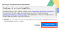
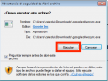
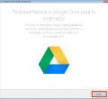
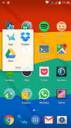
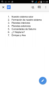
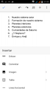
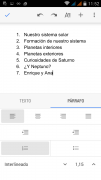
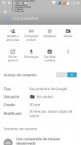

{#top}

Google drive/Google Drive para ordenador y móvil {#firstHeading .firstHeading lang="es"}
========================================================================

De WikiEducator

&lt; [Google
drive](/Google_drive "Google drive")

Saltar a: [navegación](#mw-navigation), [buscar](#p-search)

[Introducción](/Google_drive/Introducci%C3%B3n "Google drive/Introducción")
 |  [Primeros
pasos](/Google_drive/Primeros_pasos "Google drive/Primeros pasos")  | 
[Creación y gestión de
archivos](/Google_drive/Creaci%C3%B3n_y_gesti%C3%B3n_de_archivos_en_Google_Drive "Google drive/Creación y gestión de archivos en Google Drive")
 |  [Compartir y
colaborar](/Google_drive/Compartir_y_colaborar_en_Google_Drive "Google drive/Compartir y colaborar en Google Drive")
 |  **Para ordenador y móvil**

\

\

{width="209" height="178"}

Drive en
escritorio y móvil

Google nos ofrece aplicaciones nativas para nuestros dispositivos con
las que poder sincronizar documentos en la nube. De esta manera,
podremos editar o subir un documento desde nuestro ordenador y acceder a
él o seguir editándolo desde nuestro móvil o tableta.

Google Drive para escritorio
-----------------------------------------------------------------------------------------------

Podrás instalar la aplicación descargándola desde la [web de Google
Drive](https://www.google.es/intl/es/drive/download/){.external .text}.
Una vez instalada tendrás una nueva carpeta en tu ordenador con el
nombre de la aplicación (Drive). Todo lo que guardes en ella se
mantendrá sincronizado en la nube.

Lamentablemente, el cliente de escritorio está solo disponible para
Windows y Mac. Esperemos que próximamente ofrezcan la versión para
Linux, como ya lo hacen otras empresas como Dropbox.

A continuación puedes ver el proceso de instalación en imágenes.

-   

    

    

    [{width="109"
    height="120"}](/Archivo:Descargando_Google_Drive.png){.image}

    

    

    

    Descargando Google Drive

    

    

-   

    

    

    [{width="120"
    height="62"}](/Archivo:Aceptando_las_condiciones_de_uso.png){.image}

    

    

    

    Aceptando las condiciones de uso

    

    

-   

    

    

    [{width="120"
    height="42"}](/Archivo:Descarga_de_Google_Drive.png){.image}

    

    

    

    Descarga de Google Drive

    

    

-   

    

    

    [{width="120"
    height="90"}](/Archivo:Comenzando_la_instalaci%C3%B3n_de_Drive.png){.image}

    

    

    

    Comenzando la instalación de Drive

    

    

-   

    

    

    [{width="120"
    height="110"}](/Archivo:Instalando_Google_Drive02.png){.image}

    

    

    

    Instalando Google Drive

    

    

-   

    

    

    [{width="120"
    height="111"}](/Archivo:Instalando_Google_Drive03.png){.image}

    

    

    

    Instalando Google Drive

    

    

-   

    

    

    [{width="120"
    height="58"}](/Archivo:Google_Drive_instalado.png){.image}

    

    

    

    Google Drive instalado

    

    

Google Drive para móvil
------------------------------------------------------------------------------------------

Como cualquier otra aplicación para Android o iOS, ésta se instala desde
la respectiva tienda de aplicaciones: App Store para iOS y Google Play
en Android. Bastará con acceder a dichas tiendas desde nuestro
dispositivo móvil y darle a instalar. Tendremos entonces acceso a
nuestros archivos desde el teléfono, siempre que tengamos conexión a
internet. Posteriormente veremos cómo trabajar sin conexión.

Las siguientes imágenes nos dan una idea sobre cómo se ve Drive en
nuestro móvil.

-   

    

    

    [{width="68"
    height="120"}](/Archivo:Accediendo_a_la_App_de_Drive.png){.image}

    

    

    

    Accediendo a la App de Drive

    

    

-   

    

    

    [{width="68"
    height="120"}](/Archivo:Varias_cuentas_en_tu_Drive.svg){.image}

    

    

    

    Drive móvil soporta varias cuentas

    

    

-   

    

    

    [{width="68"
    height="120"}](/Archivo:Visualizando_un_Documento.png){.image}

    

    

    

    Visualizando un Documento

    

    

-   

    

    

    [{width="68"
    height="120"}](/Archivo:Opciones_dentro_de_un_Documento.png){.image}

    

    

    

    Opciones dentro de un Documento

    

    

-   

    

    

    [{width="68"
    height="120"}](/Archivo:Editando_un_documento.png){.image}

    

    

    

    Editando un documento

    

    

-   

    

    

    [{width="68"
    height="120"}](/Archivo:Insertando_elementos_en_un_documento.png){.image}

    

    

    

    Insertando elementos en un documento

    

    

-   

    

    

    [{width="68"
    height="120"}](/Archivo:Formateando_el_texto_de_un_documento.png){.image}

    

    

    

    Formateando el texto de un documento

    

    

-   

    

    

    [{width="68"
    height="120"}](/Archivo:Formateando_los_p%C3%A1rrafos_de_un_documento.png){.image}

    

    

    

    Formateando los párrafos de un documento

    

    

-   

    

    

    [{width="68"
    height="120"}](/Archivo:A%C3%B1adiendo_funciones_en_una_Hoja_de_C%C3%A1lculo.png){.image}

    

    

    

    Añadiendo funciones en una Hoja de Cálculo

    

    

-   

    

    

    [{width="68"
    height="120"}](/Archivo:Opciones_del_bot%C3%B3n_%22informaci%C3%B3n%22.png){.image}

    

    

    

    Opciones del botón "información"

    

    

Trabajando sin conexión
------------------------------------------------------------------------------------------

Podremos acceder y editar nuestros Documentos, Hojas de Cálculo y
Presentaciones incluso cuando no estemos conectados a internet. Tan solo
tenemos que activar el acceso sin conexión, eso sí, mientras aún estamos
conectados.

Los siguientes pasos se han de realizar con la aplicación Drive abierta.

#### En Android

Podremos tocar y mantener pulsado un archivo durante 1 o 2 segundos y
posteriormente extender la selección añadiendo otros archivos. Si todos
ellos son del tipo Documentos, Hojas de Cálculo o Presentaciones,
podremos entonces pulsar en
[{width="18"
height="18"}](/Archivo:Chincheta.png){.image} hacerlos accesibles sin
conexión. También podremos pulsar en el icono
[{width="14" height="14"
srcset="/images/thumb/d/dd/InfoLogo.png/21px-InfoLogo.png 1.5x, /images/thumb/d/dd/InfoLogo.png/28px-InfoLogo.png 2x"}](/Archivo:InfoLogo.png){.image}
que aparece en la sección inferior derecha de cada archivo, y activar el
"Acceso sin conexión".

Para **encontrar archivos guardados sin conexión** accederemos al menú
[{width="18"
height="18"}](/Archivo:Men%C3%BA_applicaciones_Android.png){.image} y
pulsaremos en "[{width="18"
height="18"}](/Archivo:Chincheta.png){.image} Sin conexión".

#### En iOS

Para activar o desactivar el acceso sin conexión, pulsaremos el icono
[{width="18"
height="18"}](/Archivo:Men%C3%BAIOS.png){.image} que hay junto a cada
archivo y después "Descargar y mantener sincronizado".

#### En Ordenador

El acceso sin conexión aquí se establece para todos los archivos en
conjunto, no para archivos específicos. Esta opción sólo funciona si
accedemos a nuestros documentos de Drive a través de Google Chrome. No
está disponible en otros navegadores.

-   Una vez en tu unidad Drive, clica en la ruleta de configuración
    [{width="18"
    height="18"}](/Archivo:Ruleta_Configuracion.png){.image}.
-   Selecciona "Configuración".
-   Marca la casilla "Sincronizar los archivos de Documentos, Hojas de
    Cálculo, Presentaciones y Dibujos de Google con este ordenador para
    editarlos sin conexión".

[Introducción](/Google_drive/Introducci%C3%B3n "Google drive/Introducción")
 |  [Primeros
pasos](/Google_drive/Primeros_pasos "Google drive/Primeros pasos")  | 
[Creación y gestión de
archivos](/Google_drive/Creaci%C3%B3n_y_gesti%C3%B3n_de_archivos_en_Google_Drive "Google drive/Creación y gestión de archivos en Google Drive")
 |  [Compartir y
colaborar](/Google_drive/Compartir_y_colaborar_en_Google_Drive "Google drive/Compartir y colaborar en Google Drive")
 |  **Para ordenador y móvil**

\

Obtenido de
«[http://es.wikieducator.org/index.php?title=Google\_drive/Google\_Drive\_para\_ordenador\_y\_móvil&oldid=19130](http://es.wikieducator.org/index.php?title=Google_drive/Google_Drive_para_ordenador_y_m%C3%B3vil&oldid=19130)»

