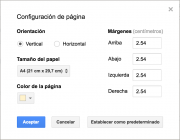
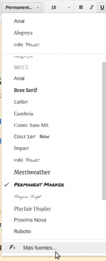

Google drive/Introducción a Documentos de Google {#firstHeading .firstHeading lang="es"}

De WikiEducator

&lt; [Google
drive](/Google_drive "Google drive")

Saltar a: [navegación](#mw-navigation), [buscar](#p-search)

**Editando un Documento**  |  [El menú
insertar](/Google_drive/El_men%C3%BA_insertar_en_Documentos_de_Google "Google drive/El menú insertar en Documentos de Google")
 |  [El menú
herramientas](/Google_drive/El_men%C3%BA_herramientas_en_Documentos_de_Google "Google drive/El menú herramientas en Documentos de Google")
 |  [Complementos y combinaciones de
teclas](/Google_drive/Complementos_y_combinaciones_de_teclas_en_Documentos_de_Google "Google drive/Complementos y combinaciones de teclas en Documentos de Google")
 | 
[Colaborando](/Google_drive/Colaborando_con_Documentos_de_Google "Google drive/Colaborando con Documentos de Google")

\

Editando un
documento

Documentos de Google es un procesador de texto que ofrece las opciones
medias típicas de cualquier software de este tipo. Destaca, no obstante,
en el ámbito colaborativo, ofreciéndonos herramientas muy potentes para
el trabajo en equipo con documentos.

En el [primer
módulo](/Google_drive/Creaci%C3%B3n_y_gesti%C3%B3n_de_archivos_en_Google_Drive "Google drive/Creación y gestión de archivos en Google Drive")
ya tuvimos una toma de contacto con la interfaz. A continuación,
profundizaremos en las opciones propias y más características de
Documentos.

Primeros pasos
-------------------------------------------------------------------

{.thumbimage

Configuración página Documentos de Google

Clica en Archivo - Configuración de página. En este menú podrás
establecer la orientación, tamaño, color de la página y márgenes.
Comienza a introducir texto como en cualquier procesador. También podrás
copiar texto, cortarlo y pegarlo, pero tendrás que utilizar los atajos
de teclado si no te has descargado la aplicación *Documentos*, que son
respectivamente **Ctrl+c**, **Ctrl+x** y **Ctrl+v**.
¿Crees que podrías haber escrito una frase en otro sitio? Selecciónala
y, manteniendo pulsado el botón izquierdo del ratón, arrástrala donde
quieras. Dale formato a esa frase o a todo el texto si quieres
utilizando los botones de la barra de herramientas.

Un par de consejos
---------------------------------------------------------------------------

height="329"}](/Archivo:Seleccionar_tipo_de_texto.png){.image}

Seleccionando tipo de texto

Añadiendo fuentes

\#No cambies constantemente la fuente (tipo de letra). En su lugar,
trata de seleccionar en cada momento el tipo de texto que estás
añadiendo (Título, subtítulo, Título 1...). De esta manera tus
documentos tendrán un aspecto uniforme y serán más fáciles de leer. Y si
no te gustan los estilos que Documentos trae por defecto, no te
preocupes, puedes crear los tuyos. Selecciona el texto que tenga el
formato que quieras conservar como tipo de texto, clica en la zona
derecha de la etiqueta *Título*, *texto normal*... y dale a "Actualizar
\_\_ para que coincida". ¿Sabías que puedes añadir nuevas fuentes para
usarlas en tus documentos? Cuando vayas a seleccionar la fuente que
desees, baja hasta el final de la lista y clica en *Más fuentes*.

&lt;/gallery&gt;

1.  Utiliza la tecla TAB para situarte donde quieras empezar a escribir.
    De esta forma te sitúas en puntos concretos del documento. Puedes
    incluso añadir tus propias tabulaciones clicando sobre la regla que
    hay debajo de la barra de herramientas.

Imprimir
-------------------------------------------------------

¿Tienes ya tu documento escrito? Imprímelo clciando en el icono
correspondiente o en *Archivo* - *Imprimir*. También puedes utilizar el
atajo de teclado Ctrl+p. Podrás imprimir, descargar como .pdf o elegir
una ubicación dentro de tu Drive o el de otra cuenta para guardarlo.

\

**Editando un Documento**  |  [El menú
insertar](/Google_drive/El_men%C3%BA_insertar_en_Documentos_de_Google "Google drive/El menú insertar en Documentos de Google")
 |  [El menú
herramientas](/Google_drive/El_men%C3%BA_herramientas_en_Documentos_de_Google "Google drive/El menú herramientas en Documentos de Google")
 |  [Complementos y combinaciones de
teclas](/Google_drive/Complementos_y_combinaciones_de_teclas_en_Documentos_de_Google "Google drive/Complementos y combinaciones de teclas en Documentos de Google")
 | 
[Colaborando](/Google_drive/Colaborando_con_Documentos_de_Google "Google drive/Colaborando con Documentos de Google")

\

Obtenido de
«[http://es.wikieducator.org/index.php?title=Google\_drive/Introducción\_a\_Documentos\_de\_Google&oldid=19472](http://es.wikieducator.org/index.php?title=Google_drive/Introducci%C3%B3n_a_Documentos_de_Google&oldid=19472)»

