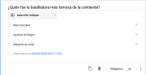

{#top}

Google drive/Preguntas de Formularios de Google {#firstHeading .firstHeading lang="es"}
=======================================================================

De WikiEducator

&lt; [Google
drive](/Google_drive "Google drive")

Saltar a: [navegación](#mw-navigation), [buscar](#p-search)

[La
interfaz](/Google_drive/Interfaz_de_Formularios_de_Google "Google drive/Interfaz de Formularios de Google")
 |  **Las preguntas**  |  [Las
respuestas](/Google_drive/Respuestas_de_Formularios_de_Google "Google drive/Respuestas de Formularios de Google")

\

\

{width="209" height="178"}

Preguntas de
Formularios de Google

En este apartado veremos los tipos de preguntas que podemos hacer en un
formulario de Google. Clicando sobre el icono [{width="16"
height="16"
srcset="/images/thumb/f/fc/A%C3%B1adir_pregunta.svg/24px-A%C3%B1adir_pregunta.svg.png 1.5x, /images/thumb/f/fc/A%C3%B1adir_pregunta.svg/32px-A%C3%B1adir_pregunta.svg.png 2x"}](/Archivo:A%C3%B1adir_pregunta.svg "Añadir pregunta"){.image}
aparecerá una nueva pregunta justo debajo de la sección que tengamos
seleccionada. Por defecto esta pregunta será de selección múltiple.
Clica sobre ella y verás que aparecen más opciones, entre ellas un
desplegable para cambiar el tipo de pregunta. Vamos a ver las opciones
avanzadas de cada una.

Respuesta corta, párrafo y escala lineal
------------------------------------------------------------------------------------------------------------------------------

[{width="300"
height="118"
srcset="/images/thumb/c/c6/Validaci%C3%B3n_de_datos_en_respuesta_de_texto.png/450px-Validaci%C3%B3n_de_datos_en_respuesta_de_texto.png 1.5x, /images/thumb/c/c6/Validaci%C3%B3n_de_datos_en_respuesta_de_texto.png/600px-Validaci%C3%B3n_de_datos_en_respuesta_de_texto.png 2x"}](/Archivo:Validaci%C3%B3n_de_datos_en_respuesta_de_texto.png "Validación de datos en respuesta de texto"){.image}

Veremos estos tres tipos de pregunta juntas porque tienen en general las
mismas opciones. Si clicas en [{width="18"
height="18"}](/Archivo:Men%C3%BAIOS.png){.image} puedes elegir si
mostrar un **Texto de ayuda**, para guiar al alumno, o el menú
**Validación de datos**. Imagina que estás pidiendo que introduzcan su
mail. Con esta opción puedes evitar que tus encuestados envíen mails sin
@ o que no terminen con su tipo de dominio (.com .es...), que envíen
respuestas numéricas fuera de rango, etc. ¿Para qué utilizarías estos
tres tipos de pregunta?
Selección múltiple y Desplegable
-----------------------------------------------------------------------------------------------------------------

[{.thumbimage
width="180" height="93"
srcset="/images/thumb/0/0d/Pregunta_de_selecci%C3%B3n_m%C3%BAltiple_en_Formularios_de_Google.png/270px-Pregunta_de_selecci%C3%B3n_m%C3%BAltiple_en_Formularios_de_Google.png 1.5x, /images/thumb/0/0d/Pregunta_de_selecci%C3%B3n_m%C3%BAltiple_en_Formularios_de_Google.png/360px-Pregunta_de_selecci%C3%B3n_m%C3%BAltiple_en_Formularios_de_Google.png 2x"}](/Archivo:Pregunta_de_selecci%C3%B3n_m%C3%BAltiple_en_Formularios_de_Google.png){.image}

[{width="15"
height="11"}](/Archivo:Pregunta_de_selecci%C3%B3n_m%C3%BAltiple_en_Formularios_de_Google.png "Aumentar"){.internal}

Pregunta de selección múltiple en Formularios de Google

Este tipo de preguntas nos permite seleccionar una sola opción entre
varias propuestas. Sus opciones avanzadas nos permiten redirigir a los
encuestados a una sección concreta del formulario según su respuesta.
Además, las respuestas quedarán registradas en la hoja de cálculo
escritas exactamente como nosotros queremos. Esto nos facilitará mucho
el tratamiento de estos datos.
Pero,¿qué es una sección y como se añade? Clicando sobre el icono
[{width="18"
height="18"
srcset="/images/thumb/b/bc/Two_rows.svg/27px-Two_rows.svg.png 1.5x, /images/thumb/b/bc/Two_rows.svg/36px-Two_rows.svg.png 2x"}](/Archivo:Two_rows.svg "Añadir una sección"){.image}
crearemos otro apartado sobre el que introducir cualquier elemento
propio de un formulario. Al final de cada sección, excepto de la última,
podremos decir qué camino tomar.

-   Ir a la siguiente sección.
-   Ir a una sección en concreto.
-   Enviar el formulario.

Casillas de verificación
--------------------------------------------------------------------------------------------

Aquí los encuestados podrán seleccionar más de una opción. En
**Validación de datos** dispondrás de las siguientes opciones para
limitar las respuestas aceptadas:

-   Selecciona por lo menos
-   Selecciona como máximo
-   Selecciona exactamente

Cuadrícula de varias opciones
------------------------------------------------------------------------------------------------------

Imagina que quieres evaluar de 1 a 5, siendo 1 "decepcionante" y 5
"apasionante", la experiencia de cada alumno en su visita a las
distintas salas del Parque de las Ciencias. Podríamos ir añadiendo filas
con el nombre de las salas a medida que rellenamos esta pregunta. En las
columnas escribiríamos "decepcionante" ... "apasionante". Pero, cada vez
que añado una fila, automáticamente me añade una columna. ¿Cómo hago
para tener distinto número de filas y columnas? No te preocupes, una vez
hayas rellenado todas las opciones, elimina las que no uses clicando en
la X correspondiente.

Puedes **Exigir una respuesta por fila** y **Limitar a una respuesta por
columna** para garantizar que las respuestas tengan sentido.

Títulos, imágenes y vídeos
------------------------------------------------------------------------------------------------------------

Si quieres dar título y descripción a una zona del formulario, pero no
necesitas las opciones de redireccionamiento que te ofrece la *sección*,
clica en [{width="18"
height="18"
srcset="/images/thumb/a/a7/Texto_T.svg/27px-Texto_T.svg.png 1.5x, /images/thumb/a/a7/Texto_T.svg/36px-Texto_T.svg.png 2x"}](/Archivo:Texto_T.svg "Icono texto"){.image}.
También podrás insertar vídeos [{width="18" height="18"
srcset="/images/thumb/0/0f/Youtube_svg.svg/27px-Youtube_svg.svg.png 1.5x, /images/thumb/0/0f/Youtube_svg.svg/36px-Youtube_svg.svg.png 2x"}](/Archivo:Youtube_svg.svg "Icono youtube"){.image}
e imágenes [{width="18"
height="18"
srcset="/images/thumb/e/e3/Photo.svg/27px-Photo.svg.png 1.5x, /images/thumb/e/e3/Photo.svg/36px-Photo.svg.png 2x"}](/Archivo:Photo.svg "Icono de imagen"){.image}

Presta atención a los botones bajo la edición de cada pregunta
[{width="272"
height="40"
srcset="/images/thumb/2/23/Opciones_de_cada_pregunta.png/407px-Opciones_de_cada_pregunta.png 1.5x, /images/thumb/2/23/Opciones_de_cada_pregunta.png/543px-Opciones_de_cada_pregunta.png 2x"}](/Archivo:Opciones_de_cada_pregunta.png "Opciones de cada pregunta"){.image}.
¿Tienes que configurar varias preguntas parecidas con las mismas
opciones? **Duplica** la pregunta modelo y edita la nueva. Si deslizas
el botón **Obligatorio**, nadie podrá enviar un formulario sin contestar
a esa pregunta.

¡Nada más! Ya sabes crear tu propio formulario.

\

[La
interfaz](/Google_drive/Interfaz_de_Formularios_de_Google "Google drive/Interfaz de Formularios de Google")
 |  **Las preguntas**  |  [Las
respuestas](/Google_drive/Respuestas_de_Formularios_de_Google "Google drive/Respuestas de Formularios de Google")

\

Obtenido de
«<http://es.wikieducator.org/index.php?title=Google_drive/Preguntas_de_Formularios_de_Google&oldid=19480>»

