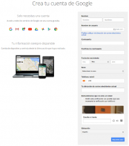
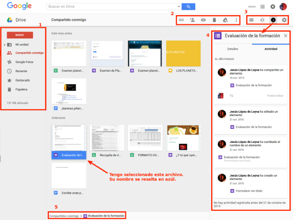

{#top}

Google drive/Primeros pasos {#firstHeading .firstHeading lang="es"}
===================================================

De WikiEducator

&lt; [Google
drive](/Google_drive "Google drive")

Saltar a: [navegación](#mw-navigation), [buscar](#p-search)

[Introducción](/Google_drive/Introducci%C3%B3n "Google drive/Introducción")
 |  **Primeros pasos**  |  [Creación y gestión de
archivos](/Google_drive/Creaci%C3%B3n_y_gesti%C3%B3n_de_archivos_en_Google_Drive "Google drive/Creación y gestión de archivos en Google Drive")
 |  [Compartir y
colaborar](/Google_drive/Compartir_y_colaborar_en_Google_Drive "Google drive/Compartir y colaborar en Google Drive")
 |  [Para ordenador y
móvil](/Google_drive/Google_Drive_para_ordenador_y_m%C3%B3vil "Google drive/Google Drive para ordenador y móvil")

\

\

{width="209" height="178"}

Introducción a
nuestro Drive

[{.thumbimage width="186"
height="210"
srcset="/images/thumb/7/74/Crear_cuenta_en_Google.png/280px-Crear_cuenta_en_Google.png 1.5x, /images/thumb/7/74/Crear_cuenta_en_Google.png/373px-Crear_cuenta_en_Google.png 2x"}](/Archivo:Crear_cuenta_en_Google.png){.image}

[{width="15"
height="11"}](/Archivo:Crear_cuenta_en_Google.png "Aumentar"){.internal}

Creando una cuenta Google

### Creando una cuenta de Google

Para tener acceso a Drive es necesario tener abierta una cuenta Google.
Para ello tenemos que entrar
[aquí](https://accounts.google.com/SignUp?hl=es){.external .text} o
escribir en un buscador: crear cuenta en Google. También podríamos
hacerlo entrando en www.gmail.com y clicando en "CREAR UNA CUENTA".

En cualquier caso llegaremos a una pantalla como la que ves a la
derecha.

Google tiene que verificar la cuenta, así que nos pedirá un número de
teléfono móvil (nos mandarán un código) o una cuenta de correo que ya
tengamos (nos enviarán un enlace para verificar la cuenta).

Una vez creada, ya tenemos acceso a Gmail y a Google Drive, entre otros
servicios. Con nuestra sesión iniciada y estando en www.google.es, por
ejemplo, podremos acceder de forma rápida a todas nuestras aplicaciones.

[{width="400"
height="255"
srcset="/images/thumb/c/c1/Lanzador_de_Aplicaciones_de_Google.png/600px-Lanzador_de_Aplicaciones_de_Google.png 1.5x, /images/thumb/c/c1/Lanzador_de_Aplicaciones_de_Google.png/800px-Lanzador_de_Aplicaciones_de_Google.png 2x"}](/Archivo:Lanzador_de_Aplicaciones_de_Google.png "Accediendo a Google Drive"){.image}

\

### La interfaz de Google Drive

En la siguiente imagen podéis ver los principales botones de la interfaz
junto con la descripción de las funciones menos intuitivas.

[{.thumbimage width="600"
height="451"
srcset="/images/thumb/c/c4/Entorno_Google_Drive.svg/900px-Entorno_Google_Drive.svg.png 1.5x, /images/thumb/c/c4/Entorno_Google_Drive.svg/1200px-Entorno_Google_Drive.svg.png 2x"}](/Archivo:Entorno_Google_Drive.svg){.image}

[{width="15"
height="11"}](/Archivo:Entorno_Google_Drive.svg "Aumentar"){.internal}

Una panorámica del entorno de trabajo en Google Drive

1.  En este menú podremos seleccionar qué elementos queremos que nos
    muestre la zona central del aplicación: los guardados en **Mi
    unidad**, mis fotos (**Google Fotos**), el material que he marcado
    cono **Destacado**...
2.  Cuando tenemos un archivo seleccionado aparece este menú. Podremos
    compartir un archivo mediante **enlace** o **invitación**, revisar
    el documento con la opción **vista previa**, **guardarlo en Mi
    unidad** y varias opciones más si clicamos sobre los 3 puntos.
3.  En la **ruleta** de este menú podremos **configurar** nuestro Drive.
4.  Esta es la **información** que se nos muestra si clicamos en
    **"i"**.
5.  Nos dice la **ruta** en la que está alojado el archivo.

[Introducción](/Google_drive/Introducci%C3%B3n "Google drive/Introducción")
 |  **Primeros pasos**  |  [Creación y gestión de
archivos](/Google_drive/Creaci%C3%B3n_y_gesti%C3%B3n_de_archivos_en_Google_Drive "Google drive/Creación y gestión de archivos en Google Drive")
 |  [Compartir y
colaborar](/Google_drive/Compartir_y_colaborar_en_Google_Drive "Google drive/Compartir y colaborar en Google Drive")
 |  [Para ordenador y
móvil](/Google_drive/Google_Drive_para_ordenador_y_m%C3%B3vil "Google drive/Google Drive para ordenador y móvil")

\

Obtenido de
«<http://es.wikieducator.org/index.php?title=Google_drive/Primeros_pasos&oldid=19477>»

