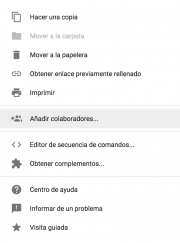

Google drive/Respuestas de Formularios de Google {#firstHeading .firstHeading lang="es"}

De WikiEducator

&lt; [Google
drive](/Google_drive "Google drive")

Saltar a: [navegación](#mw-navigation), [buscar](#p-search)

[La
interfaz](/Google_drive/Interfaz_de_Formularios_de_Google "Google drive/Interfaz de Formularios de Google")
 |  [Las
preguntas](/Google_drive/Preguntas_de_Formularios_de_Google "Google drive/Preguntas de Formularios de Google")
 |  **Las respuestas**

\

Respuestas de
Formularios de Google

Todas las respuestas que vayamos recibiendo a través de nuestro
formulario se irán almacenando en el mismo, a modo de resumen, y en una
hoja de cálculo. Se nos abre pues un sin fin de posibilidades. ¿Quieres
saber más?

Vista resumen, individual... ¿se aceptan respuestas?
--------------------------------------------------------------------------------------------------------------------------------------------------------

En la sección **Respuestas** podremos ver un **resumen** de las
respuestas recibidas hasta el momento. Éste será el que se muestre a
todos los encuestados al enviar el formulario, si en la configuración

hemos seleccionado *Ver un resumen de las respuestas*.

\
También podrás ver las respuestas de cada encuestado (**individual**) y
cerrar el cuestionario para no recibir más repuestas deslizando el botón
**Se aceptan respuestas**.

Ver respuestas en hoja de cálculo
--------------------------------------------------------------------------------------------------------------

En 

podrás ver las respuestas en la hoja de cálculo. Si no has seleccionado
aún un destino para las respuestas podrás hacerlo ahora. Se creará en tu
Drive una hoja de cálculo con el mismo título del formulario seguido de
*(respuestas)*. A partir de este momento cuentas con la potencia que
ofrecen las hojas de cálculo en cuanto a gestión de datos. En el
[siguiente
módulo](/Google_drive/Introducci%C3%B3n_a_Hojas_de_C%C3%A1lculo_de_Google "Google drive/Introducción a Hojas de Cálculo de Google")
profundizaremos en este tema.

Más opciones
--------------------------------------------------------------------

{.thumbimage

Más opciones de Google Forms

Junto a 

puedes acceder a más opciones 
height="18"}](/Archivo:Men%C3%BAIOS.png){.image}. Éstas son:
-   Recibir notificaciones por correo electrónico de respuestas nuevas
-   Seleccionar destino de las respuestas
-   Desenlazar formulario
-   Descargar respuestas (.csv)
-   Eliminar todas las respuestas

¿Quieres añadir colaboradores para que editen el formulario, obtener
complementos...? Clica sobre 
height="18"}](/Archivo:Men%C3%BAIOS.png){.image}, esta vez en la esquina
superior derecha de la pantalla. Te aparecerá el menú que ves en la
imagen de la derecha.

[La
interfaz](/Google_drive/Interfaz_de_Formularios_de_Google "Google drive/Interfaz de Formularios de Google")
 |  [Las
preguntas](/Google_drive/Preguntas_de_Formularios_de_Google "Google drive/Preguntas de Formularios de Google")
 |  **Las respuestas**

\

Obtenido de
«<http://es.wikieducator.org/index.php?title=Google_drive/Respuestas_de_Formularios_de_Google&oldid=19481>»

