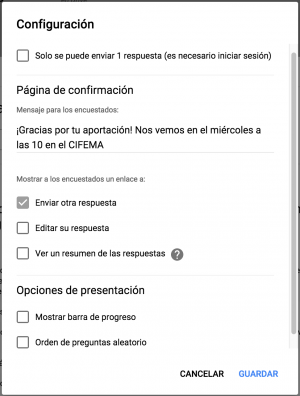
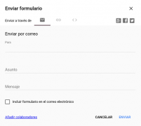
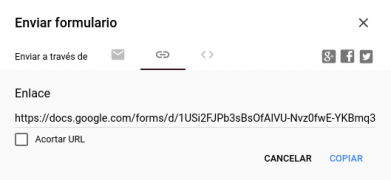
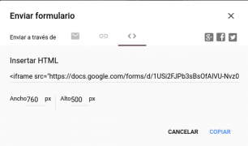

{#top}

Interfaz de Formularios de Google {#firstHeading .firstHeading lang="es"}
=========================================================

De WikiEducator

&lt; [Google
drive](/Google_drive "Google drive")

Saltar a: [navegación](#mw-navigation), [buscar](#p-search)

\

**La interfaz**  |  [Las
preguntas](/Google_drive/Preguntas_de_Formularios_de_Google "Google drive/Preguntas de Formularios de Google")
 |  [Las
respuestas](/Google_drive/Respuestas_de_Formularios_de_Google "Google drive/Respuestas de Formularios de Google")

\

{width="209" height="178"}

La interfaz de
Formularios de Google

Interfaz de Formularios de Google {#interfaz-de-formularios-de-google}
---------------------------------------------------------------------------------------------------------

Esta aplicación es bastante más sencilla. Podremos realizar nuestros
propios formularios para recoger datos de una forma muy eficaz. Hace
poco Google ha rediseñado la interfaz de Formularios. En este curso
trabajaremos con la nueva para que esté actualizado el máximo tiempo
posible. No obstante, una vez sepas trabajar con la aplicación, las
diferencias entre un diseño u otro no son significativas. Por el
momento, puedes cambiar de una a otra fácilmente clicando en *Probar la
nueva versión de Formularios de Google*, justo debajo de la barra de
herramientas, o clicando en [{width="17"
height="24"}](/Archivo:Volver_a_la_versi%C3%B3n_anterior_de_Google_Forms.png "Volver a la versión anterior de Google Forms"){.image}
en la esquina inferior izquierda de la nueva interfaz.

[{width="500" height="203"
srcset="/images/thumb/d/d4/Formularios_de_google.png/750px-Formularios_de_google.png 1.5x, /images/thumb/d/d4/Formularios_de_google.png/1000px-Formularios_de_google.png 2x"}](/Archivo:Formularios_de_google.png "Formularios de google"){.image}

1.  Título del archivo Formulario.
2.  Acceso a los complementos instalados.
3.  Cambia la paleta de colores de tu formulario o elige un tema.
4.  Vista previa. Echa un vistazo a cómo está quedando.
5.  Configura las opciones básicas.
6.  Envía tu formulario por correo, comparte un link en tu blog
    o insértalo. También puedes publicarlo en tus redes sociales.
7.  Podrás añadir colaboradores, imprimir, dejar rellenos algunos campos
    y obtener nuevos complementos.
8.  Crea tu formulario añadiendo preguntas.
9.  Haz un seguimiento de las respuestas que estás recibiendo.
10. Añade una pregunta.
11. Añade una etiqueta de texto Título y descripción.
12. Añade una imagen, un vídeo o una sección (apartados entre los que se
    puede redirigir al usuario).
13. Título y descripción del cuestionario.
14. Ejemplo de pregunta de respuesta corta.

Configura tu formulario [{width="18" height="18" srcset="/images/thumb/3/37/Settings-work-tool.svg/27px-Settings-work-tool.svg.png 1.5x, /images/thumb/3/37/Settings-work-tool.svg/36px-Settings-work-tool.svg.png 2x"}](/Archivo:Settings-work-tool.svg "Rueda de configuración"){.image}
-------------------------------------------------------------------------------------------------------------------------------------------------------------------------------------------------------------------------------------------------------------------------------------------------------------------------------------------------------------------------------------------------------------------------

[{.thumbimage
width="300" height="396"
srcset="/images/thumb/5/56/Configuraci%C3%B3n_del_formulario.png/450px-Configuraci%C3%B3n_del_formulario.png 1.5x, /images/thumb/5/56/Configuraci%C3%B3n_del_formulario.png/600px-Configuraci%C3%B3n_del_formulario.png 2x"}](/Archivo:Configuraci%C3%B3n_del_formulario.png){.image}

[{width="15"
height="11"}](/Archivo:Configuraci%C3%B3n_del_formulario.png "Aumentar"){.internal}

Configuración del formulario

Clicando en la ruleta accederás a las opciones que puedes ver en la
siguiente imagen. Piensa bien para qué estás haciendo el cuestionario.
Según el propósito del mismo, hay que tener cuidado con las casillas que
activas.
-   ¿Quieres hacerles una prueba sencilla de conocimientos a tus
    alumnos? Marca la 1ª casilla *Solo se puede enviar 1 respuesta*.
-   ¿Quieres utilizar el formulario para rellenarlo las veces que haga
    falta para recoger datos de una forma cómoda? Añade un link a
    *Enviar otra respuesta* al final del cuestionario.
-   ¿Vas a recoger datos personales de cada encuestado que no deben ser
    vistos por el resto de participantes? NO marques la casilla *Ver un
    resumen de las respuestas*.

Envía y publica tu formulario
------------------------------------------------------------------------------------------------------

Clica en **ENVIAR** en la zona superior derecha de la pantalla para
acceder a las siguientes opciones:

-   Compartir por mail: podrás elegir los destinatarios y redactar
    el mail. Se añadirá un enlace de forma automática en tu mail para
    que los encuestados accedan a él. También puedes incrustar
    directamente el formulario en el mail que envías seleccionando
    *Incluir formulario en el correo electrónico*.
-   Publicar enlace: dicho enlace llevará a tus encuestados hasta el
    formulario publicado. Podrán entonces rellenarlo y enviarlo. También
    tienes la opción de acortar la url para compartirla con
    más facilidad.
-   Embeber o incrustar: te genera un iframe con el que puedes incrustar
    tu formulario en tu página web o blog. Puedes redimensionar aquí
    mismo el tamaño de dicho iframe.
-   Utiliza también los botones sociales para dar difusión a
    tu encuesta.

<!-- -->

-   

    

    

    [{width="134"
    height="120"}](/Archivo:Enviar_formulario_por_mail.png){.image}

    

    

    

    Enviar formulario por mail

    

    

-   

    

    

    [{width="261"
    height="120"}](/Archivo:Enviar_formulario_mediante_enlace.png){.image}

    

    

    

    Enviar formulario mediante enlace

    

    

-   

    

    

    [{width="204"
    height="120"}](/Archivo:Embeber_formulario.png){.image}

    

    

    

    Embeber formulario

    

    

\

**La interfaz**  |  [Las
preguntas](/Google_drive/Preguntas_de_Formularios_de_Google "Google drive/Preguntas de Formularios de Google")
 |  [Las
respuestas](/Google_drive/Respuestas_de_Formularios_de_Google "Google drive/Respuestas de Formularios de Google")

\

Obtenido de
«<http://es.wikieducator.org/index.php?title=Google_drive/Interfaz_de_Formularios_de_Google&oldid=19524>»

