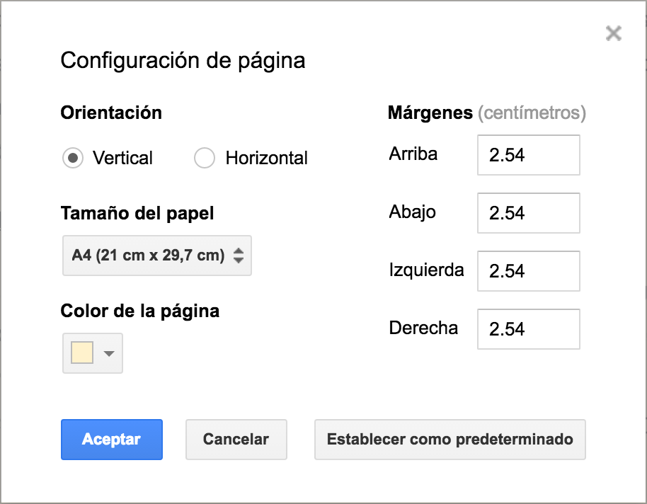
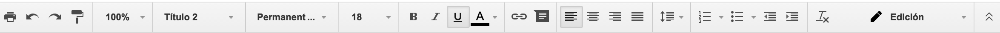
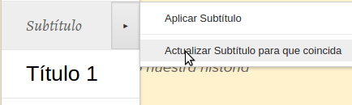
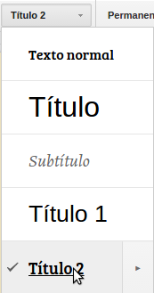
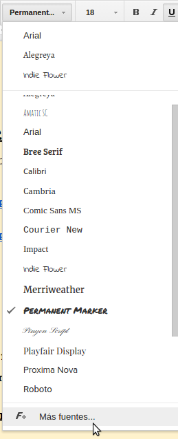

Documentos de Google es un procesador de texto que ofrece las opciones medias típicas de cualquier software de este tipo. Destaca, no obstante, en el ámbito colaborativo, ofreciéndonos herramientas muy potentes para el trabajo en equipo con documentos.

En el [primer módulo](creacion-y-gestion-de-archivos-en-google-driver.md) ya tuvimos una toma de contacto con la interfaz. A continuación, profundizaremos en las opciones propias y más características de Documentos.

## Primeros pasos

Clica en Archivo - Configuración de página. En este menú podrás
establecer la orientación, tamaño, color de la página y márgenes.
Comienza a introducir texto como en cualquier procesador. También podrás
copiar texto, cortarlo y pegarlo, pero tendrás que utilizar los atajos
de teclado si no te has descargado la aplicación *Documentos*, que son
respectivamente **Ctrl+c**, **Ctrl+x** y **Ctrl+v**.
¿Crees que podrías haber escrito una frase en otro sitio? Selecciónala
y, manteniendo pulsado el botón izquierdo del ratón, arrástrala donde
quieras. Dale formato a esa frase o a todo el texto si quieres
utilizando los botones de la barra de herramientas.

## Un par de consejos

**No cambies constantemente la fuente (tipo de letra)**. En su lugar,
trata de seleccionar en cada momento el tipo de texto que estás
añadiendo (Título, subtítulo, Título 1...). De esta manera tus
documentos tendrán un aspecto uniforme y serán más fáciles de leer. Y si
no te gustan los estilos que Documentos trae por defecto, no te
preocupes, puedes crear los tuyos. Selecciona el texto que tenga el
formato que quieras conservar como tipo de texto, clica en la zona
derecha de la etiqueta *Título, texto normal*... y dale a _"Actualizar
\_\_ para que coincida"_. ¿Sabías que puedes añadir nuevas fuentes para
usarlas en tus documentos? Cuando vayas a seleccionar la fuente que
desees, baja hasta el final de la lista y clica en *Más fuentes*.

## Imprimir

¿Tienes ya tu documento escrito? Imprímelo clciando en el icono
correspondiente o en *Archivo* - *Imprimir*. También puedes utilizar el
atajo de teclado Ctrl+p. Podrás imprimir, descargar como .pdf o elegir
una ubicación dentro de tu Drive o el de otra cuenta para guardarlo.

https://www.youtube.com/watch?v=znaqqES7w_U