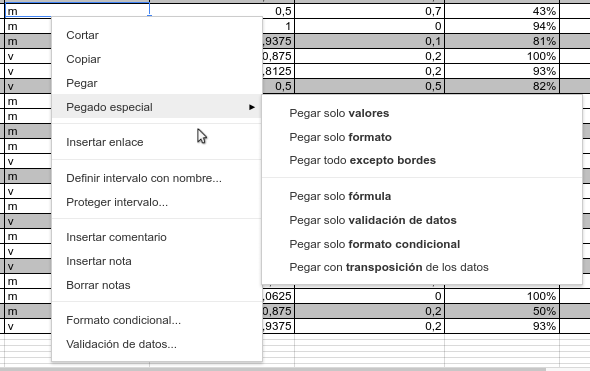
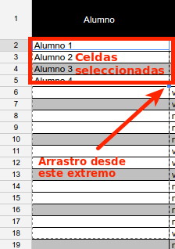
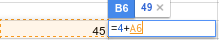
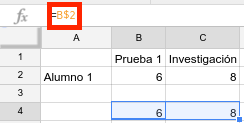
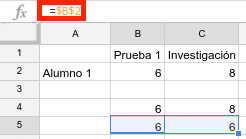
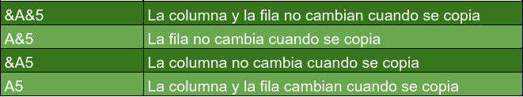

# Introduciendo datos

Como ya hemos visto anteriormente, para introducir datos basta con clicar en una celda y comenzar a escribir. También puedes escribir en la barra de fórmulas. Si queremos editar una celda que ya tiene datos sin borrar el contenido de la misma, clica sobre ella dos veces. Aparecerá entonces el cursor dentro de la celda y podrás añadir o quitar lo que quieras.

Además de añadir datos mediante el teclado tenemos otras herramientas disponibles. Vamos a verlas.

## Copiar, cortar y pegar

Al igual que en la gran mayoría de aplicaciones de edición, los atajos de teclado para copiar, cortar y pegar son respectivamente **Ctrl+c**, **Ctrl+x** y **Ctrl+v**. Estás opciones están también disponibles a través del menú *Editar*. Selecciona una o varias celdas (clica sobre una y arrastra), cópialas o córtalas y sitúa el cursor donde quieras pegarlas. Dale a Ctrl+V y listo.

Merece especial atención la opción *Pegado especial*. En la siguiente imagen verás las posibilidades que te ofrece.

¿Quieres mover datos de una celda a otra? Otra opción es hacer lo que se conoce como *drag and drop*, es decir, *arrastrar y soltar*. Selecciona una celda y sitúa el cursor en uno de los bordes de la misma. Verás que tu cursor se transforma en una mano. Mantén pulsado entonces el botón izquierdo del ratón y arrastra la celda a su nueva posición. Suelta el botón del ratón para dejar fija la celda.

## Rellenar

Si tenemos una serie y queremos extenderla a lo largo de un conjunto de celdas primero debemos seleccionar la celda o celdas ya rellenas. Después nos situamos en la esquina inferior derecha de ese conjunto de celdas, mantenemos pulsado y arrastramos. Las siguientes imágenes pueden aclarar el proceso.

## Referencias

 También podemos introducir datos presentes ya en otras celdas haciendo
referencia a las mismas. Para hacer referencia a otra celda comenzamos escribiendo el signo igual =. Después añadiremos la celda que queremos mostrar. Es decir, introduciremos en primer lugar la columna (letra) y posteriormente la fila (número). Una referencia a una celda sería por ejemplo =F5. No obstante, bastará con escribir el = y después clicar sobre la celda a la que queremos hacer referencia.

Hay dos tipos de referencias: relativas y absolutas -lo que vas a leer a continuación es algo complejo. Lo entenderás mejor viendo el vídeo o las imágenes-. ¿Qué las diferencia? Por ejemplo, si rellenamos un conjunto de celdas a partir de una referencia relativa, ésta se va incrementando en cada celda. Sin embargo, si hacemos lo mismo a basándonos en una referencia absoluta, ésta se mantiene constante. Utilizaremos el signo \$ para hacer absoluta una referencia.   

¿Sabías que puedes hacer referencia [a celdas de otra hoja](https://support.google.com/docs/answer/75943?hl=es%7C)? ¿Y [a celdas de otro documento Hojas de Cálculo](https://support.google.com/docs/answer/3093340?hl=es%7C).