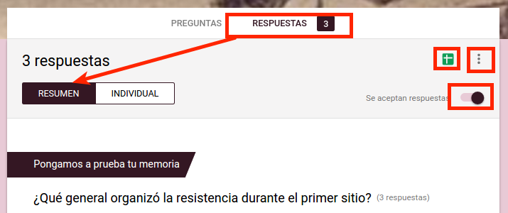
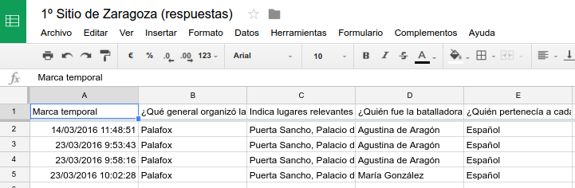
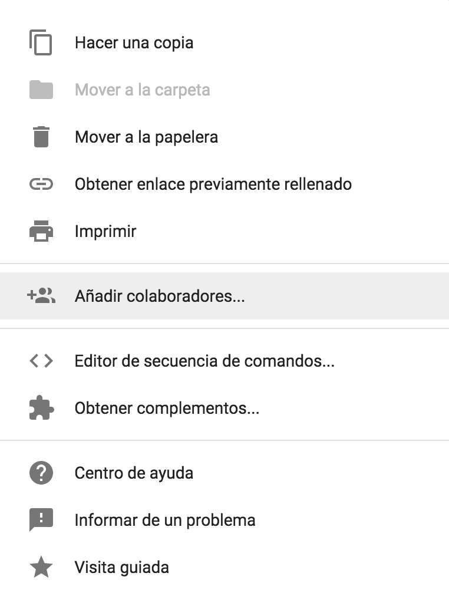

# Respuestas de Formularios de Google

Todas las respuestas que vayamos recibiendo a través de nuestro formulario se irán almacenando en el mismo, a modo de resumen, y en una
hoja de cálculo. Se nos abre pues un sin fin de posibilidades. ¿Quieres saber más?

## Vista resumen, individual... ¿se aceptan respuestas?

En la sección **Respuestas** podremos ver un **resumen** de las respuestas recibidas hasta el momento. Éste será el que se muestre a todos los encuestados al enviar el formulario, si en la configuración  hemos seleccionado *Ver un resumen de las respuestas*.

También podrás ver las respuestas de cada encuestado (**individual**) y
cerrar el cuestionario para no recibir más repuestas deslizando el botón
**Se aceptan respuestas**.

## Ver respuestas en hoja de cálculo

En  podrás ver las respuestas en la hoja de cálculo. Si no has seleccionado aún un destino para las respuestas podrás hacerlo ahora. Se creará en tu Drive una hoja de cálculo con el mismo título del formulario seguido de *(respuestas)*. A partir de este momento cuentas con la potencia que ofrecen las hojas de cálculo en cuanto a gestión de datos. En el [siguiente módulo](introduccion-a-hojas-de-calculo-de-google.md) profundizaremos en este tema.

## Más opciones

Junto a  puedes acceder a más opciones . Éstas son:
-   Recibir notificaciones por correo electrónico de respuestas nuevas
-   Seleccionar destino de las respuestas
-   Desenlazar formulario
-   Descargar respuestas (.csv)
-   Eliminar todas las respuestas

¿Quieres añadir colaboradores para que editen el formulario, obtener complementos...? Clica sobre , esta vez en la esquina superior derecha de la pantalla. Te aparecerá el menú que ves en la imagen de la derecha.

https://www.youtube.com/watch?v=idLgIqufbZc